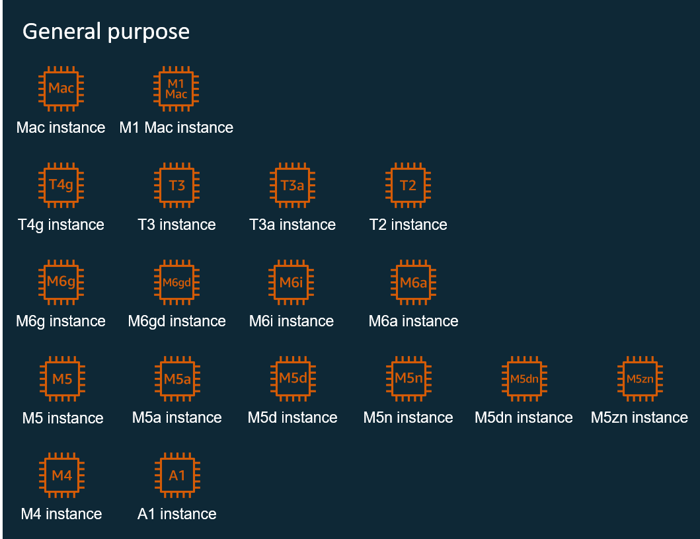
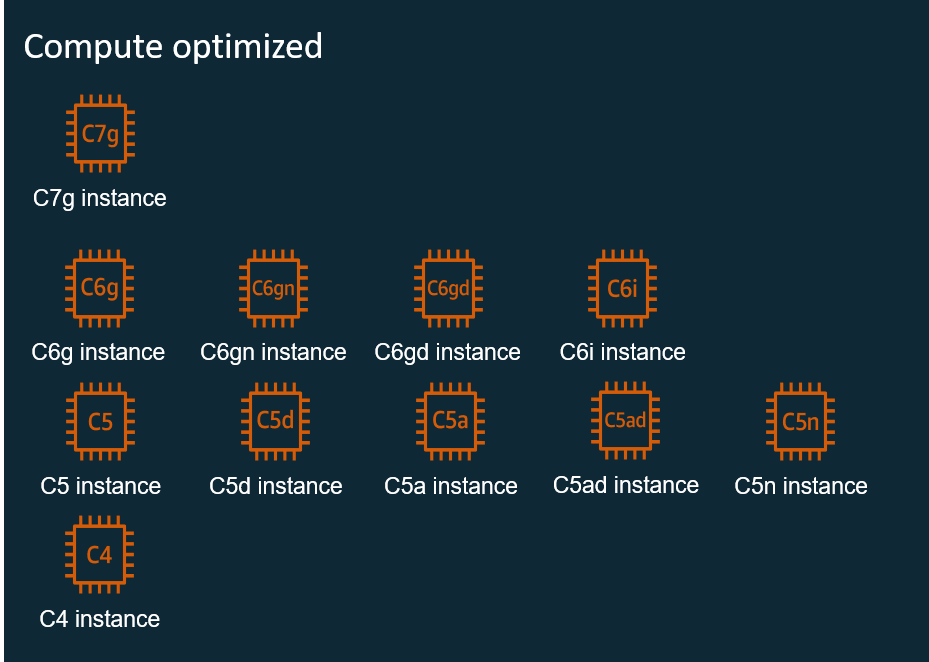
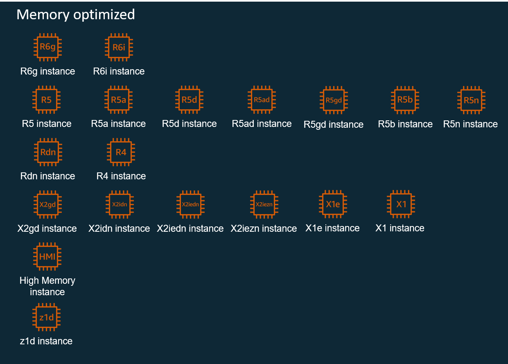
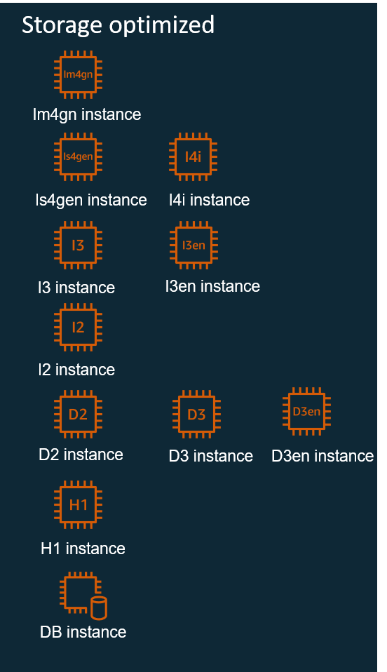
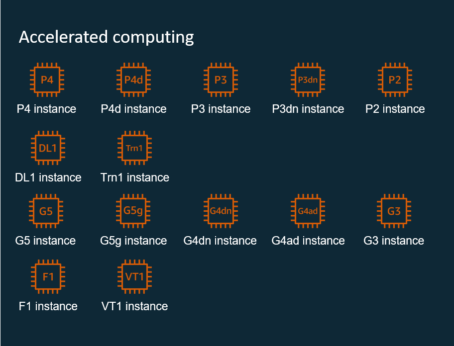
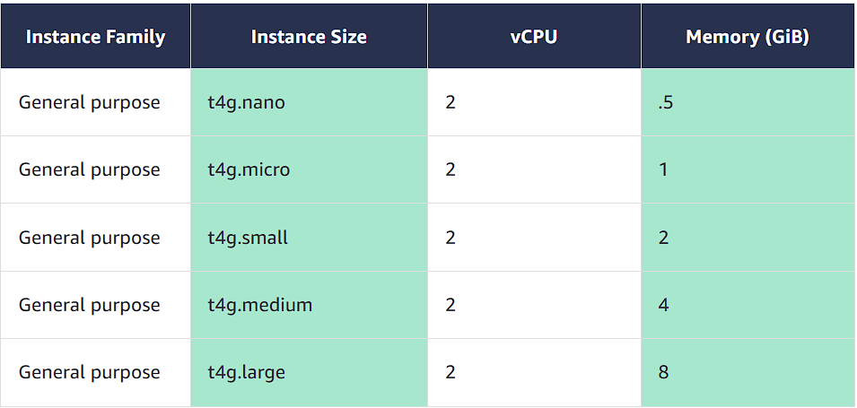

# AWS EC2 (Elastic Compute Cloud)

## Overview

An **EC2 instance** is a virtual machine (VM) that runs in the AWS Cloud. When launching an instance, you decide the virtual hardware configuration by choosing an instance type.

Each instance type offers different combinations of:

- **Compute** power
- **Memory** capacity
- **Storage** options

## Instance Families

Instance types are grouped into **instance families**, with each family optimized for specific use cases. Instance families have sub-families that are grouped by combination of processor and storage types.

### Key Terms

- **vCPU**: Virtual CPU represents a thread of the underlying physical CPU core (1 vCPU = 1 Thread)

## Instance Categories

AWS offers **5 main instance categories**:

### 1. General Purpose

**Use Case**: Balanced compute, memory, and networking resources

**Ideal for**:

- Web servers
- Code repositories

### 2. Compute Optimized

**Use Case**: Compute-bound applications that benefit from high-performance processors

**Ideal for**:

- Batch processing workloads
- Media transcoding
- High performance web servers
- High performance computing (HPC)
- Scientific modeling
- Dedicated gaming servers and ad server engines
- Machine learning (ML) inference

### 3. Memory Optimized

**Use Case**: Fast performance for workloads that process large data sets in memory

### 4. Storage Optimized

**Use Case**: Workloads requiring high, sequential read and write access to very large data sets on local storage

### 5. Accelerated Computing

**Use Case**: Hardware accelerators or co-processors to perform functions more efficiently than software running on CPUs

**Examples**:

- Floating point number calculations
- Graphics processing
- Data pattern matching

## Instance Sizing

Instance sizing is based on the combined hardware resources consumed by that instance type:

- vCPU capacity
- Memory capacity
- Storage capacity
- Networking capacity

## Additional Instance Characteristics

Instance names can include additional capabilities indicated by specific letters:

| Letter | Characteristic             |
| ------ | -------------------------- |
| **a**  | AMD processors             |
| **g**  | AWS Graviton processors    |
| **i**  | Intel processors           |
| **d**  | Instance store volumes     |
| **n**  | Network optimization       |
| **b**  | Block storage optimization |
| **e**  | Extra storage or memory    |
| **z**  | High frequency             |

## Pricing Models for Amazon EC2

AWS offers **6 different pricing categories** to meet various use cases and budget requirements:

### 1. On-Demand Instances

**Payment Model**: Pay full price by the second when you launch

**Best For**:

- Users who prefer low cost and flexibility without up-front payment or long-term commitment
- Applications with short-term, spiky, or unpredictable workloads that cannot be interrupted
- Applications being developed or tested on Amazon EC2 for the first time

### 2. Spot Instances

**Payment Model**: Bid on unused instance resources - price determined by market availability

**Best For**:

- Applications that have flexible start and end times and can tolerate interruptions
- Applications you want to run or test only when compute prices are in your price range
- Applications that are lower priority in your environment
- Users with urgent computing needs for large amounts of additional capacity at a price they determine

### 3. Savings Plans

**Payment Model**: Commit to a certain amount of usage over 1–3 year period

**Types Available**:

- **Compute Savings Plans**: Apply to usage across Amazon EC2, AWS Lambda, and AWS Fargate
- **EC2 Instance Savings Plans**: Apply to Amazon EC2 usage only
- **Amazon SageMaker Savings Plans**: Apply to SageMaker usage

### 4. Reserved Instances

**Payment Model**: Agree to a specific instance configuration for 1–3 year period

**Best For**:

- Steady-state loads and long running systems
- Core components with minimal high peaks or valleys of usage

### 5. Dedicated Hosts

**Payment Model**: Get a full physical server

**Best For**:

- Workloads that require server-bound software licenses
- Security and regulatory compliance cases where your workload cannot share hardware with other tenants

### 6. Dedicated Instances

**Payment Model**: Instances that run on hardware dedicated to a single customer

**Best For**:

- Compliance requirements that require hardware isolation
- Workloads that need to be separated from other customers at the hardware level
