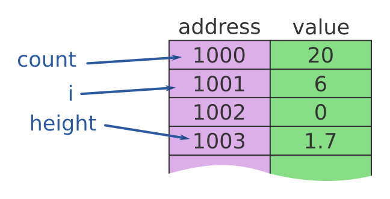
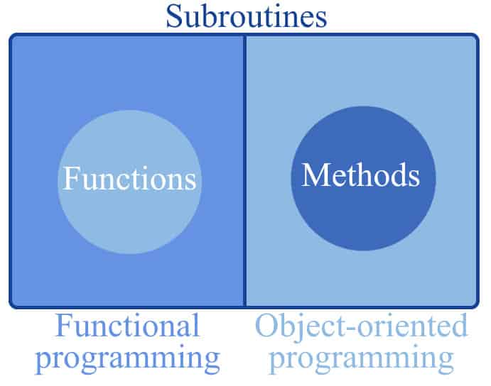

# Variables, Functions, and Methods in Programming

## 📦 Variables

A **variable** is a **named storage location in memory** that stores data.
They allow programmers to **store, retrieve, and manipulate data** during program execution.

### Examples

* `userAge = 25`
* `productPrice = 19.99`

```csharp
int userAge = 25;
double productPrice = 19.99;
```



---

### 🔄 Variable Declaration: Mutable vs Immutable

#### ✅ Mutable Variables

* Can **change values** after being declared.

```csharp
int counter = 1;
counter = 2; // value changed
```

#### 🔒 Immutable Variables

* **Cannot change** once set.
* Declared with:

  * `const` → for compile-time constants.
  * `readonly` → for values assigned at runtime.

```csharp
const double PI = 3.14159;    // compile-time constant
readonly int maxAttempts = 5; // runtime constant
```

---

### 📊 Diagram: Variables

```plaintext
Variable (Memory Representation)
---------------------------------
Name      | Type   | Value
---------------------------------
userAge   | int    | 25
PI        | const  | 3.14159
counter   | int    | 2
```

---

## ⚙️ Functions

A **function** is a **block of code** that:

1. Takes **input** (parameters).
2. Processes data (logic).
3. Returns a **result**.

```csharp
int Add(int a, int b)
{
    return a + b;
}

int result = Add(3, 5); // result = 8
```

✅ Functions are **general-purpose** and not necessarily tied to objects or classes.

---

## 🏛 Methods (in OOP)

A **method** is similar to a function, but it is always **part of a class**.

* Methods can **access and modify class data**.
* They represent the **behavior** of an object.

### Example: Product Class

```csharp
class Product
{
    public string Name;
    public int Stock;

    public void UpdateStock(int amount)
    {
        Stock += amount;
    }
}

// Usage
Product p = new Product();
p.Name = "Laptop";
p.Stock = 10;
p.UpdateStock(5); // Stock = 15
```

---

### 🔄 Functions vs Methods

| Aspect            | Function        | Method                  |
| ----------------- | --------------- | ----------------------- |
| Belongs to        | Independent     | Class/Object            |
| Access Class Data | ❌ No           | ✅ Yes                 |
| Usage             | General-purpose | Defines object behavior |

---


---

### 📊 Diagram: Function vs Method

```plaintext
Function
--------------------------------
Add(a, b) → returns a + b
Independent, no class data


Method (in Product class)
--------------------------------
Attributes:
- Name
- Stock

Method:
- UpdateStock(amount) → modifies Stock
Bound to object → modifies class state
```

---

## 🎯 Key Takeaways

* **Variables** store data in memory (mutable or immutable).
* **Functions** are reusable code blocks that return results, not tied to classes.
* **Methods** are similar to functions but belong to **classes**, enabling OOP behavior.

---
