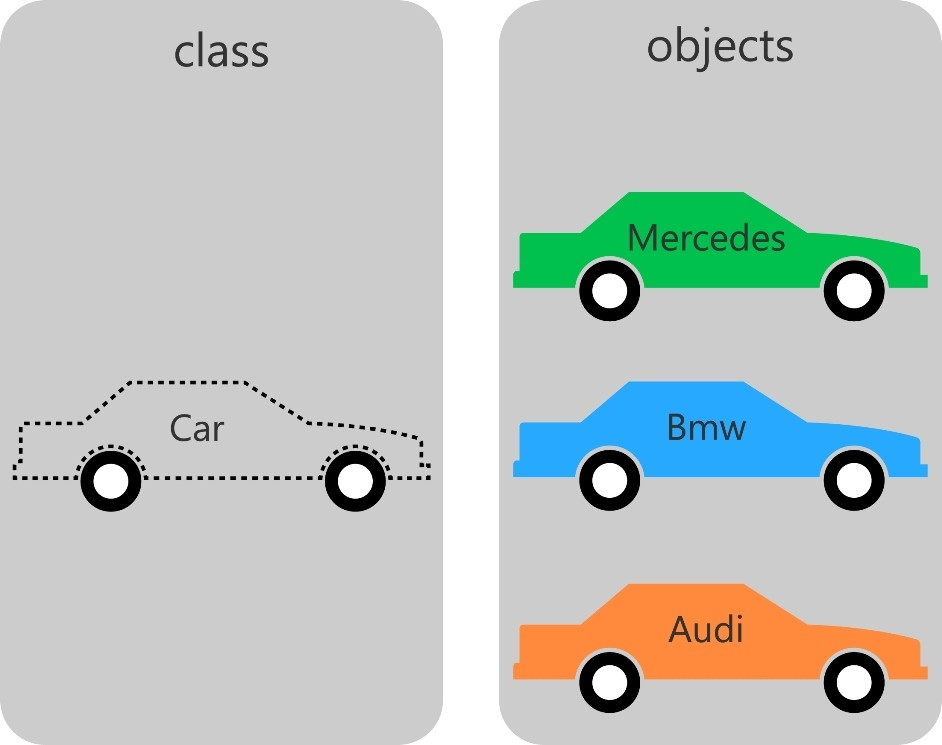
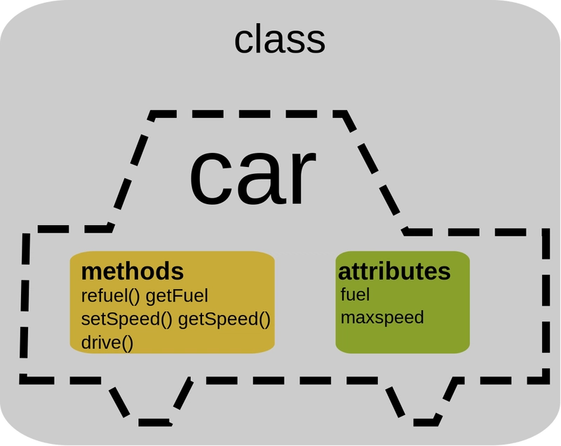
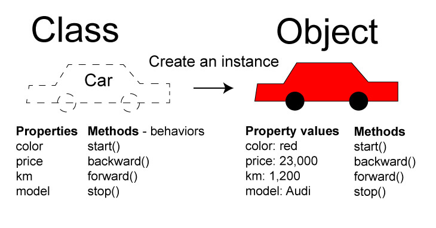

# 🧱 Objects and Classes in OOP

## 🔗 Fundamental Components of OOP

In **Object-Oriented Programming (OOP)**, the two most important building blocks are:

* **Classes** → define the structure and behavior of entities.
* **Objects** → real-world instances created from those classes.

Together, they allow developers to model real-world systems in code, making programs more **modular, reusable, and easier to maintain**.



## 📘 What Are Classes?

* A **class** is a **blueprint** or **template** for creating objects.
* It defines:

  * **Properties (attributes/data)** → what an object *has*.
  * **Methods (functions/behaviors)** → what an object *can do*.

  

---

## 📕 What Are Objects?

* An **object** is an **instance of a class**.
* Each object has its own **unique data**, but follows the same **structure** and **behavior** defined by the class.



---

## 🏛️ Example: Library System

### Class: Book

```cpp
Class: Book
----------------------------------
Properties:
- title
- author
- ISBN

Methods:
+ Borrow()
+ Return()
```

### Objects (Instances)

```cpp
book1 → title: "1984", author: "George Orwell", ISBN: 978-0451524935
book2 → title: "The Hobbit", author: "J.R.R. Tolkien", ISBN: 978-0345339683
```

---

## 📊 Visual Diagram

```cpp
        Class (Blueprint)
        ┌───────────────────────┐
        │        Book           │
        │-----------------------│
        │ - title               │
        │ - author              │
        │ - ISBN                │
        │-----------------------│
        │ + Borrow()            │
        │ + Return()            │
        └───────────────────────┘
                 ▲
     ┌───────────┼───────────┐
     │                       │
Object: book1          Object: book2
"1984"                 "The Hobbit"
George Orwell          J.R.R. Tolkien
```

---

✅ **Key Takeaways**

* A **class** defines the *structure* and *behavior*.
* An **object** is a *real-world instance* of a class.
* This approach makes code **reusable, scalable, and organized**.
