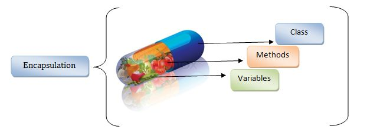
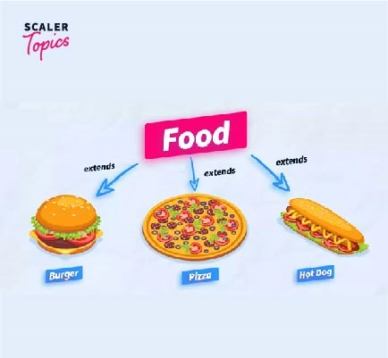
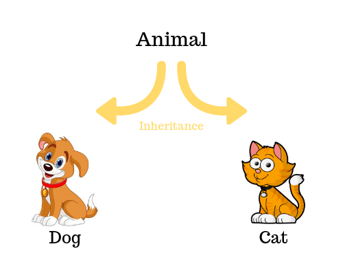
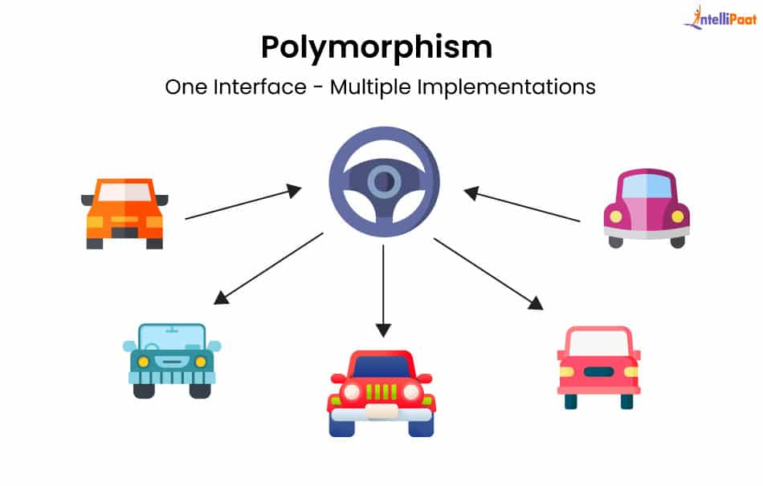

# 🌐 Object-Oriented Programming (OOP) Principles

Object-Oriented Programming (OOP) is built around **four fundamental principles**:

1. 🔒 **Encapsulation** – Protect internal state
2. 🧩 **Abstraction** – Define *what* an object does, not *how*
3. 🧬 **Inheritance** – Reuse and extend code through parent-child classes
4. 🎭 **Polymorphism** – One interface, many implementations

These principles help developers build **flexible, reusable, and organized** software.

---

## 🔒 Encapsulation

### 🛡️ Protecting Internal State



Encapsulation is the principle of **bundling methods and data into a class** while **restricting access** to some of its components.

* The internal state is hidden from outside code.
* Access is controlled using **access modifiers**:

| Modifier      | Access Scope              | Example Use Case                      |
| ------------- | ------------------------- | ------------------------------------- |
| **Private**   | Only inside the class     | Hide sensitive fields (`balance`)     |
| **Protected** | Inside class + subclasses | Extend behavior in inheritance        |
| **Public**    | Anywhere in the app       | Provide controlled access via methods |

#### Example: Bank Account

```plaintext
Class: BankAccount
-------------------------------------
- balance (private)
- interestRate (private)
+ GetBalance() → public
+ Deposit(amount) → public
+ Withdraw(amount) → public
```

✅ **Encapsulation** ensures the integrity of data and prevents unauthorized changes.

---

## 🧩 Abstraction

### 🎭 Hide the Underlying Complexity



Abstraction defines **what an object does** but not **how it does it**.
Developers use **abstract classes** and **interfaces** to achieve this.

* **Abstract Class** → Can include both concrete and abstract methods.
* **Interface** → Defines only method signatures (contracts).

#### Example: Banking Abstraction

```plaintext
Abstract Class: Account
-------------------------------------
- amount
+ Deposit(amount)   (abstract)
+ Withdraw(amount)  (abstract)

Class: SavingsAccount → implements Deposit, Withdraw
Class: CheckingAccount → implements Deposit, Withdraw
```

✅ **Abstraction** creates consistency while allowing flexible implementations.

---

## 🧬 Inheritance

### 🌳 Building on Existing Classes



Inheritance allows developers to create a **new class (derived/child)** based on an **existing class (base/parent)**.
The child class inherits attributes and methods, but can also **extend or override** them.

* ✅ **Reuse code** instead of rewriting it
* ✅ **Extend functionality** with new methods/attributes
* ✅ **Override behavior** for customization

#### Example: Bird Hierarchy

```plaintext
Class: Bird (Base)
---------------------------------
Properties:
- species
Methods:
+ Fly()

Class: Eagle (Derived)
---------------------------------
Inherits: Fly()
Adds: Hunt()

Class: Parrot (Derived)
---------------------------------
Inherits: Fly()
Adds: Speak()
```

📊 **Diagram**

```plaintext
            Base Class
          ┌─────────────┐
          │    Bird     │
          │-------------│
          │ + Fly()     │
          └─────▲───────┘
                │
     ┌──────────┴──────────┐
     │                     │
┌─────────────┐      ┌─────────────┐
│    Eagle    │      │   Parrot    │
│-------------│      │-------------│
│ + Hunt()    │      │ + Speak()   │
└─────────────┘      └─────────────┘
```

---

## 🎭 Polymorphism

### 🔀 One Interface, Many Behaviors



Polymorphism means **“many forms”**.
It allows a **single method name** to perform **different tasks** depending on the object.

Achieved through:

* **Overriding** → Derived class provides its *own version* of a base class method.
* **Overloading** (C#) → Methods with the same name but different parameters.

#### Example: CoffeeMaker

```plaintext
Class: CoffeeMaker (Base)
---------------------------------
Methods:
+ Water()
+ Beans()

Class: Drip (Derived)
---------------------------------
Uses: Water(), Beans() (as-is)
Adds: Vessel()

Class: SuperAutomatic (Derived)
---------------------------------
Overrides: Beans() → adds "Grind Beans"
Uses: Water() (as-is)
```

📊 **Diagram**

```plaintext
          Base Class
        ┌───────────────────┐
        │   CoffeeMaker     │
        │-------------------│
        │ + Water()         │
        │ + Beans()         │
        └─────────▲─────────┘
                  │
     ┌────────────┴────────────┐
     │                         │
┌─────────────┐        ┌─────────────────┐
│    Drip     │        │ SuperAutomatic  │
│-------------│        │-----------------│
│ + Vessel()  │        │Overrides Beans()│
└─────────────┘        └─────────────────┘
```

---

## 🎯 Final Takeaways

* **Encapsulation** → Protect state
* **Abstraction** → Define contracts
* **Inheritance** → Reuse and extend code
* **Polymorphism** → One interface, many forms

Together, these principles form the **foundation of OOP**, enabling developers to write **secure, reusable, flexible, and maintainable** applications.

---
