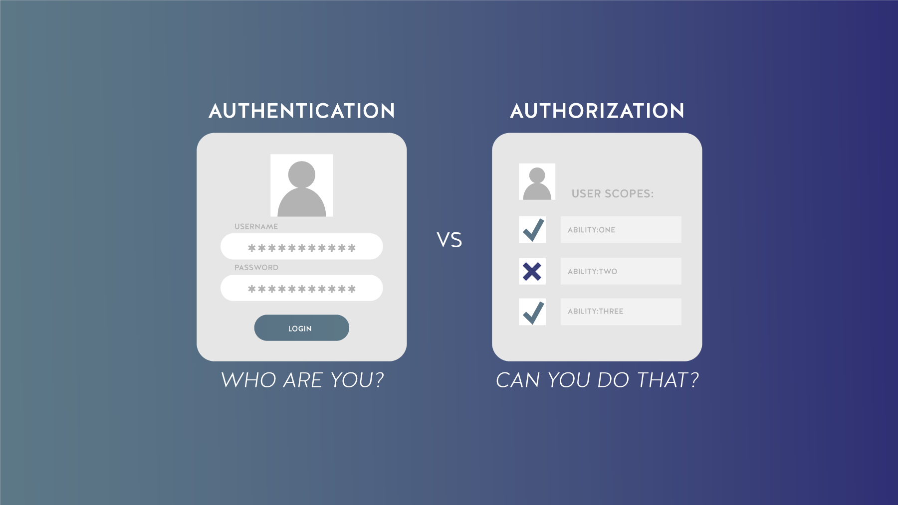

# 🔐 ASP.NET Identity — Managing Authentication, Authorization, and User Roles

## 1. 🌐 Introduction to ASP.NET and ASP.NET Identity

**ASP.NET** is a web development framework developed by **Microsoft** for building **dynamic, scalable, and secure** web applications using **C#**.

**ASP.NET Identity** is a **membership system** built into the ASP.NET framework. It handles:

* ✅ **Authentication** — verifying user identity
* ✅ **Authorization** — controlling access and permissions
* ✅ **Role management** — grouping users with similar permissions

Together, they provide a secure foundation for managing user access and identities in modern web apps.

---

## 2. 🔑 Key Features of ASP.NET Identity

### 2.1 🧍 User Authentication (AuthN)

**Authentication** verifies **who the user is** before granting access to the system.

**Example:**
When you log in to a website, you enter your username and password.
The system checks whether that information matches an existing account.
If it does, you are authenticated and allowed access.

➡️ **Purpose:** Ensure that only verified users can access personal or protected areas of the application.

---

### 2.2 🔐 User Authorization (AuthZ)

**Authorization** defines **what the user is allowed to do** after authentication.

**Example:**

* An **employee** can view only their personal information.
* A **manager** can approve time-off requests for their entire team.

➡️ **Purpose:** Control user permissions and access based on roles or privileges.



---

### 2.3 👥 User Roles

**Roles** are predefined sets of permissions assigned to groups of users.
Instead of assigning permissions to individual users, you assign them to a role, which simplifies management.

**Example:**
In an online store:

* A **Merchant** can add or edit products.
* A **Customer** can browse and make purchases.

Each role grants different capabilities.

---

### 2.4 📱 Multi-Factor Authentication (MFA)

**MFA** adds an extra layer of security by requiring an additional verification step after entering a password — for example, entering a code sent to your phone or email.

➡️ **Benefit:** Prevent unauthorized access even if the password is compromised.

---

### 2.5 🔁 Password Recovery

Users can **reset forgotten passwords** through a **secure link sent to their email**.
This helps maintain security while providing convenience.

---

### 2.6 📧 Email Confirmation

When a user registers, **ASP.NET Identity** sends a **confirmation email** to verify that the user owns the provided email address.
This step helps prevent fake or spam accounts.

---

### 2.7 ⚙️ Integration with ASP.NET Core

ASP.NET Identity is fully integrated into **ASP.NET Core**, the modern cross-platform web framework.
It allows:

* Easy configuration for secure login and registration.
* Support for **third-party authentication** (Google, Facebook, Microsoft, etc.).
* Customizable security features adaptable to different application needs.

---

### 2.8 🗄️ Data Storage with Entity Framework (EF)

ASP.NET Identity uses **Entity Framework (EF)** to store user data such as usernames, passwords, and roles in a database.

**Entity Framework** allows developers to:

* Interact with databases using **C# objects** instead of raw SQL.
* Easily perform CRUD (Create, Read, Update, Delete) operations.

**Example:**
When a user registers, their information (email, password hash, roles) is saved securely in the database through EF.
This makes it easy to retrieve and manage user data later without writing SQL queries.

---

## 3. 🧩 Summary of ASP.NET Identity Benefits

| Feature                          | Description                                     |
| -------------------------------- | ----------------------------------------------- |
| **Authentication**               | Verifies user identity                          |
| **Authorization**                | Controls what authenticated users can do        |
| **Roles**                        | Groups users with shared permissions            |
| **MFA**                          | Adds an extra security layer                    |
| **Password Recovery**            | Enables secure password reset                   |
| **Email Confirmation**           | Verifies email ownership                        |
| **ASP.NET Core Integration**     | Provides flexibility and cross-platform support |
| **Entity Framework Integration** | Simplifies secure data storage and access       |

---

## 4. 🧠 Conceptual Overview

```plaintext
           +----------------------+
           |   ASP.NET Identity   |
           +----------------------+
                     |
     +---------------+---------------+
     |                               |
 [AuthN] Authentication       [AuthZ] Authorization
     |                               |
  Verify who user is          Define what user can do
     |
     +--> Roles → Permissions Groups
     |
     +--> MFA / Password Reset / Email Confirmation
                     |
            Stored securely via
             Entity Framework (EF)
                     |
        Integrated with ASP.NET Core
```

---

## 5. 💬 In Summary

**ASP.NET Identity** provides:

* Secure and flexible **user management**
* Easy **role-based access control**
* Modern **security features** (MFA, email verification, password recovery)
* Seamless **integration** with **ASP.NET Core** and **Entity Framework**

> By implementing ASP.NET Identity, developers can ensure that their web applications are **secure, scalable, and user-friendly**, forming a solid foundation for advanced authentication systems in the future.