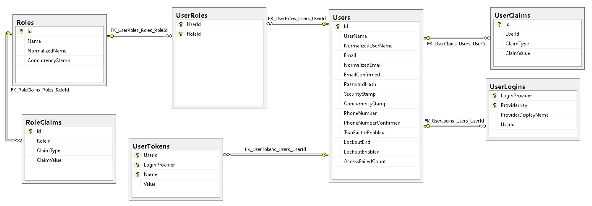

# 🔐 Understanding ASP.NET Identity Components

Controlling access to your application is critical for both **security** and **user experience**.

ASP.NET Identity provides a complete ecosystem for managing **users**, **roles**, and **authentication** in your applications.

---

## 🧩 Overview

ASP.NET Identity is made up of several core components that work together:

```
+--------------------------+
|      ASP.NET Identity    |
+-----------+--------------+
            |
            v
+-----------+-------------+
|   User Manager          |
|   Sign-in Manager       |
|   Role Manager          |
|   IdentityDB Context    |
+-------------------------+
```

Each of these components plays a specific role in user management and system security.

---

## 👤 User Manager

**Purpose:**
Manages user accounts within the application.

**Responsibilities:**

* Create new users
* Update or delete existing users
* Set and validate passwords
* Manage user claims (identity information like email or permissions)

**Example:**
When you sign up for an app, the **User Manager** handles:

* Creating your account
* Updating your profile
* Deleting your account if requested

**Diagram:**

```
User Manager
 ├── CreateUser()
 ├── UpdateUser()
 ├── DeleteUser()
 └── ManageClaims()
```

---

## 🔑 Sign-in Manager

**Purpose:**
Handles **authentication**—verifying a user’s identity during login and logout.

**Responsibilities:**

* Authenticate user credentials (username/password)
* Sign users in and out securely
* Manage session or token-based authentication

**Example:**
When you log into an app, the **Sign-in Manager**:

* Checks your username and password
* Validates credentials
* Signs you in securely

**Diagram:**

```
Sign-in Manager
 ├── PasswordSignIn()
 ├── SignOut()
 └── ValidateCredentials()
```

---

## ⚙️ Role Manager

**Purpose:**
Defines **user roles** and assigns them to users to control access within the application.

**Responsibilities:**

* Create roles (e.g., Admin, User, Editor)
* Assign users to roles
* Manage permissions based on role

**Example:**
In a company system:

* **Admins** can manage data
* **Employees** can only view limited information

**Diagram:**

```
Role Manager
 ├── CreateRole("Admin")
 ├── AddUserToRole(user, "Admin")
 └── GetRolesForUser(user)
```

---

## 🗄️ IdentityDB Context

**Purpose:**
Manages **data persistence**—securely stores user, role, and claim information in a database.

**Responsibilities:**

* Connect to the database
* Store user and role details
* Retrieve authentication data during login

**Example:**
When a user logs in, **IdentityDB Context** retrieves their:

* Username and password hash
* Roles and claims
* Access permissions

**Diagram:**

```
IdentityDB Context
 ├── Users Table
 ├── Roles Table
 └── UserRoles & Claims Tables
```



---

## 🧠 How They Work Together

All components interact to form a secure and cohesive authentication system:

```
+-----------------------+
|      User Manager     | <-- Creates and updates user accounts
+----------+------------+
           |
           v
+----------+------------+
|    Sign-in Manager    | <-- Authenticates and manages sign-ins
+----------+------------+
           |
           v
+----------+------------+
|     Role Manager      | <-- Assigns roles and permissions
+----------+------------+
           |
           v
+----------+------------+
|  IdentityDB Context   | <-- Stores user, role, and claim data
+-----------------------+
```

---

## ✅ Summary

| Component              | Role in Identity System                                  |
| ---------------------- | -------------------------------------------------------- |
| **User Manager**       | Manages user creation, updates, and claims               |
| **Sign-in Manager**    | Handles user authentication and sign-in logic            |
| **Role Manager**       | Defines and assigns user roles and permissions           |
| **IdentityDB Context** | Stores users, roles, and claims securely in the database |

ASP.NET Identity brings these components together to:

* Authenticate users
* Control access via roles
* Store data securely
