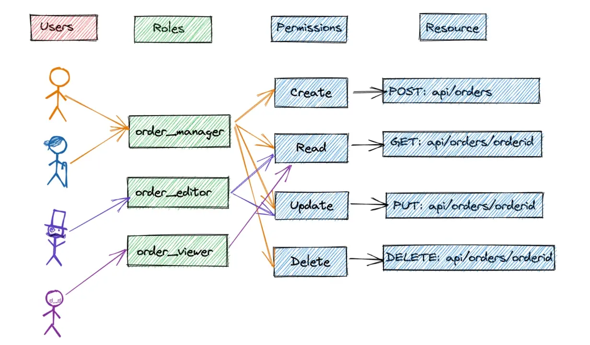

# 🔐 Role-Based Access Control (RBAC) in ASP.NET Identity

Controlling access in an application is essential for **security** and **user experience**.
In **ASP.NET Identity**, this is achieved through **role-based access control (RBAC)** — a system that defines **what users can access** based on their assigned **roles**.

---

## 🧭 What Is Role-Based Access Control (RBAC)?

**Role-Based Access Control (RBAC)** is a security mechanism that **restricts system access** to authorized users based on their **role** within an organization or system.

* Each **user** is assigned one or more **roles**.
* Each **role** defines specific **permissions** or **access levels**.
* Users can only perform actions allowed by their assigned role.

---

### 🎓 Example: School System

| Role        | Permissions                              |
| ----------- | ---------------------------------------- |
| **Teacher** | Can update and manage student grades     |
| **Student** | Can view only their personal records     |
| **Admin**   | Can manage all users and system settings |

This ensures that each user interacts with the system according to their responsibilities.

---

## ⚙️ Role Management in ASP.NET Identity

ASP.NET Identity provides the **`RoleManager`** class to create and manage user roles easily.

### 🧩 Key Responsibilities of `RoleManager`:

* Create new roles (`Admin`, `Editor`, `User`, etc.)
* Assign or remove roles for users
* Check if a user belongs to a specific role
* Delete existing roles

```csharp
// Example: Creating and assigning a role
var roleExists = await _roleManager.RoleExistsAsync("Admin");
if (!roleExists)
{
    await _roleManager.CreateAsync(new IdentityRole("Admin"));
}

await _userManager.AddToRoleAsync(user, "Admin");
```

---

## 🗄️ Role Storage with IdentityDbContext

After roles are created, they are stored in the **ASP.NET Identity database** using `IdentityDbContext`.

### Database Tables:

| Table Name        | Description                                   |
| ----------------- | --------------------------------------------- |
| `AspNetRoles`     | Stores role names (e.g., Admin, Editor, User) |
| `AspNetUserRoles` | Maps users to their assigned roles            |

`IdentityDbContext` ensures these relationships are securely maintained and synchronized.

---

## 🛍️ Example: E-Commerce Application

Let’s see how RBAC works in a typical **online shopping platform**.

| Role       | Capabilities                                                                |
| ---------- | --------------------------------------------------------------------------- |
| **Admin**  | Manage products, prices, and customer orders; create accounts; assign roles |
| **Editor** | Write and publish product descriptions                                      |
| **User**   | Browse products and make purchases                                          |

### Flow Example

1. **Admin Login**

   * System checks `IdentityDbContext` for user’s role.
   * Role found: `Admin`
   * Grants access to **Admin Dashboard** → manage products, prices, orders.

2. **User Login**

   * System checks `IdentityDbContext` for user’s role.
   * Role found: `User`
   * Grants access to **shopping features only** → browse and purchase items.

This ensures users have access **only to what they need**.



---

## 🧠 Summary

* **RBAC (Role-Based Access Control)** limits user access based on roles.
* **`RoleManager`** handles creating, assigning, and verifying roles.
* **`IdentityDbContext`** securely stores all role-related data.
* Used together, these tools ensure a **secure and well-structured access control system** in any ASP.NET application.
