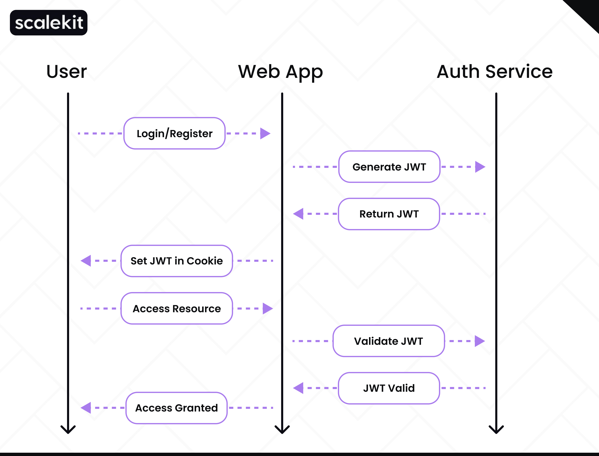

# 🛡️ Understanding Token-Based Authentication

> **How can you stay securely connected to a service without logging in repeatedly?**
> The answer lies in **token-based authentication** — a method that provides **both convenience and security** for web and API systems.

---

## 🔑 What Is a Token?

A **token** is a small piece of data used to:

* Verify a **user’s identity**
* Define **access rights** within a system

It is often:

* **Encrypted** or **digitally signed**
* Designed to ensure **authenticity** and **integrity**

---

## 🔐 What Is Token-Based Authentication?

**Token-based authentication** is a method where:

1. The user **logs in** with credentials.
2. The server **issues a token** as proof of authentication.
3. The user includes this token in **subsequent requests**.
4. The server verifies the token to grant or deny access.

```plaintext
Login → Issue Token → Client Stores Token → Send Token with Requests → Server Validates Token
```



### 🧠 Example:

When you log in to a social media platform:

* You **enter credentials once**.
* The system issues a **token**.
* Every “like”, “comment”, or “share” request uses that token.
* No need to log in again each time.

---

## 💡 JSON Web Tokens (JWT)

The most common type of token is the **JSON Web Token (JWT)**.

A **JWT** is:

* A compact, URL-safe **JSON object**
* Digitally **signed** (to prevent modification)
* Encodes user details like:

  * User ID
  * Roles or permissions

### 🧩 Structure of a JWT

```plaintext
HEADER.PAYLOAD.SIGNATURE
```

**Example:**

```json
{
  "header": { "alg": "HS256", "typ": "JWT" },
  "payload": { "sub": "student123", "role": "student" },
  "signature": "d41d8cd98f00b204e9800998ecf8427e"
}
```

---

## 🎓 Example Scenario: Student Access

A student logs into an online learning platform.

* The platform issues a **token**:

  * Identifies the user as a **student**
  * Grants access to **course materials**, **discussions**, and **assignments**

As the student moves between pages:

* The token is used for verification
* No repeated logins needed

If they try to open **teacher-only** pages →
Access is **denied** because the token lacks that permission.

---

## ⚙️ Stateless Authentication

In **stateless systems**:

* The server **does not store session data**
* Each request **carries the token**
* The server validates the token **independently**

### 📊 Diagram

```plaintext
[Client] --(Token Request)--> [Server]
[Server] --(Token Response)--> [Client Stores Token]
[Client] --(Request + Token)--> [Server Validates]
```

✅ Benefits:

* Faster response times
* Easier to scale
* No server memory for sessions

### Example:

In an online banking app:

* Each “check balance” or “transfer funds” request includes the token.
* The server authenticates using the token only — **no session tracking**.

---

## 🔒 Securing APIs with Tokens

Tokens help secure **API endpoints** by:

* Authenticating requests
* Checking **permissions**
* Preventing **unauthorized access**

Example:

> In a fitness app, only valid tokens can access a user’s personal workout history.
> Invalid or expired tokens → access denied.

---

## 🧰 Implementation Flow

```plaintext
1️⃣ User logs in → provides credentials
2️⃣ Server validates → issues token (e.g., JWT)
3️⃣ Client stores token (in cookie or local storage)
4️⃣ Client sends token with each request
5️⃣ Server verifies token:
     - ✅ Valid → access granted
     - ❌ Invalid/Expired → access denied
```

---

## 🧭 Summary

| Concept            | Description                                                 |
| ------------------ | ----------------------------------------------------------- |
| **Token**          | Small piece of data verifying user identity                 |
| **JWT**            | JSON-based signed token containing claims                   |
| **Stateless Auth** | Server does not store user sessions                         |
| **API Security**   | Tokens protect API endpoints                                |
| **Storage**        | Tokens are stored on client-side (cookies or local storage) |

---

### 💬 Key Takeaway

> **Token-based authentication** replaces repeated logins with secure, reusable tokens —
> simplifying access control while keeping systems **fast, scalable, and secure**.
