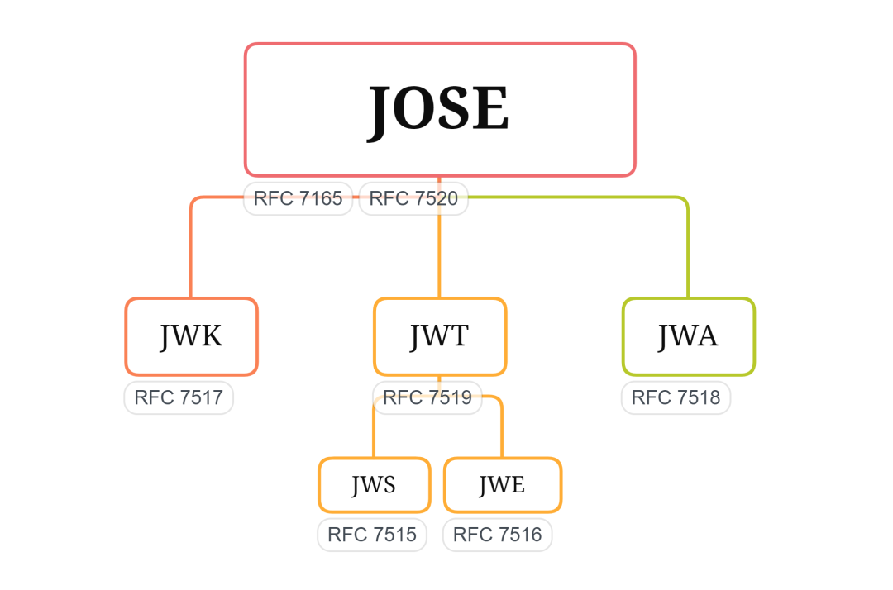

# 🧩 JSON Object Signing and Encryption (JOSE)

## Overview

**JOSE** (JSON Object Signing and Encryption) là một tập hợp các tiêu chuẩn xác định cách **truyền tải và xác minh dữ liệu một cách an toàn** bằng cấu trúc JSON.
Nó là nền tảng cho các cơ chế như **JWT (JSON Web Token)** — sử dụng JOSE để đảm bảo tính **toàn vẹn (integrity)** và **xác thực (authenticity)**.

### 📚 Thành phần của JOSE

| Standard | Full Name           | Purpose                                                                    |
| -------- | ------------------- | -------------------------------------------------------------------------- |
| **JWS**  | JSON Web Signature  | Cung cấp **integrity** và **authentication** bằng cách ký số dữ liệu.      |
| **JWE**  | JSON Web Encryption | Cung cấp **confidentiality** bằng cách mã hóa dữ liệu.                     |
| **JWK**  | JSON Web Key        | Định nghĩa định dạng JSON để **biểu diễn khóa mật mã**.                    |
| **JWA**  | JSON Web Algorithms | Xác định **các thuật toán** có thể dùng với JWS, JWE và JWK.               |
| **JWT**  | JSON Web Token      | Định dạng token gọn, URL-safe, sử dụng JWS hoặc JWE để bảo mật các claims. |

---

## 🔐 JOSE Family Relationship

```plaintext
              +-------------------------------+
              |             JOSE              |
              +-------------------------------+
                         /     |     \
                        /      |      \
                    +----+  +----+  +----+
                    | JWS|  | JWE|  | JWK|
                    +----+  +----+  +----+
                      |        |       \
                    uses     uses     defines
                      |        |        \
                    +--------------------------+
                    |          JWA             |
                    +--------------------------+
```


> ✅ **JWT** = Một định dạng dữ liệu *sử dụng* JWS (ký) hoặc JWE (mã hóa) trong khuôn khổ JOSE.

---

## 🧾 JWS — JSON Web Signature

### 📖 Mục đích

JWS được dùng để **ký số dữ liệu JSON**, đảm bảo tính **toàn vẹn** và **nguồn gốc** của thông tin.

### 🧩 Cấu trúc

```plaintext
<header>.<payload>.<signature>
```

Ví dụ:

```
eyJhbGciOiJIUzI1NiIsInR5cCI6IkpXVCJ9.
eyJpZCI6MTIzNDU2Nzg5LCJuYW1lIjoiSm9zZXBoIn0.
OpOSSw7e485LOP5PrzScxHb7SR6sAOMRckfFwi4rp7o
```

| Thành phần    | Vai trò      | Mô tả                                            |
| ------------- | ------------ | ------------------------------------------------ |
| **Header**    | Metadata     | Chứa thuật toán ký (`alg`) và loại token (`typ`) |
| **Payload**   | Claims       | Dữ liệu (thông tin người dùng, quyền, ...)       |
| **Signature** | Verification | Chứng minh dữ liệu chưa bị sửa đổi               |

### 🔍 Ví dụ chi tiết

```json
// Header
{
  "alg": "HS256",
  "typ": "JWT"
}

// Payload
{
  "id": 123456789,
  "name": "Joseph"
}

//Signature

OpOSSw7e485LOP5PrzScxHb7SR6sAOMRckfFwi4rp7o
```

**Quy trình ký:**

1. Base64URL-encode header và payload
2. Nối chúng bằng dấu chấm (`.`)
3. Dùng khóa bí mật (hoặc private key) ký toàn chuỗi
4. Nhận được **JWS Compact Serialization**

### 💡 Thuật toán thông dụng (theo JWA)

* `HS256`, `HS512` — HMAC với SHA-256/512
* `RS256`, `RS512` — RSA với SHA-256/512
* `ES256` — ECDSA với SHA-256

---

## 🕵️‍♂️ JWE — JSON Web Encryption

### 📖 Mục đích

JWE dùng để **mã hóa nội dung JSON**, đảm bảo chỉ người nhận hợp lệ có thể đọc được.

### 🧩 Cấu trúc

```plaintext
<header>.<encryptedKey>.<iv>.<ciphertext>.<authTag>
```

| Thành phần       | Vai trò                                  |
| ---------------- | ---------------------------------------- |
| **header**       | Thuật toán dùng để mã hóa                |
| **encryptedKey** | CEK (Content Encryption Key) được mã hóa |
| **iv**           | Initialization Vector ngẫu nhiên         |
| **ciphertext**   | Dữ liệu mã hóa (payload)                 |
| **authTag**      | Thẻ xác thực đảm bảo integrity           |

### 🔍 Ví dụ

```json

// header
{
  "alg": "RSA-OAEP",
  "enc": "A256GCM"
}

{
  "encrypted_key": "qtF60gW8O8cXKiYyDsBPX8OL0GQfhOxwGWUmYtHOds7FJWTNoSFnv5E6A_Bgn_2W",
  "iv": "HRhA5nn8HLsvYf8F-BzQew",
  "ciphertext": "ai5j5Kk43skqPLwR0Cu1ZIyWOTUpLFKCN5cuZzxHdp0eXQjYLGpj8jYvU8yTu9rwZQeN9EY0_81hQHXEzMQgfCsRm0HXjcEwXInywYcVLUls8Yik",
  "tag": "thh69dp0Pz73kycQ"
}
```

> ⚙️ Trong đó `alg` định nghĩa thuật toán mã hóa cho khóa CEK,
> còn `enc` định nghĩa thuật toán mã hóa cho dữ liệu nội dung.

---

## 🔑 JWK — JSON Web Key

### 📖 Mục đích

**JWK** định nghĩa cách **biểu diễn khóa mật mã** (public/private) dưới dạng JSON.

### 🧩 Cấu trúc

JWK bao gồm:

* Một **JWK Container Object** (chứa mảng `keys`)
* Các **JWK Key Objects** bên trong

Ví dụ:

```json
{
  "keys": [
    {
      "kty": "RSA",
      "alg": "RS256",
      "n": "0vx7agoebGcQSuuPiLJXZptN9nndrQmbXEps2aiAFbWhM78LhWx4cbbfAAtVT86zwu1RK7aPFFxuhDR1L6tSoc_BJECPebWKRXjBZCiFV4n3oknjhMstn64tZ_2W-5JsGY4Hc5n9yBXArwl93lqt7_RN5w6Cf0h4QyQ5v-65YGjQR0_FDW2QvzqY368QQMicAtaSqzs8KJZgnYb9c7d0zgdAZHzu6qMQvRL5hajrn1n91CbOpbISD08qNLyrdkt-bFTWhAI4vMQFh6WeZu0fM4lFd2NcRwr3XPksINHaQ-G_xBniIqbw0Ls1jF44-csFCur-kEgU8awapJzKnqDKgw",
      "e": "AQAB",
      "kid": "2011-04-29"
    }
  ]
}
```

> 💡 Các máy chủ xác thực (như Keycloak, Auth0, Google...) thường cung cấp endpoint
> `/.well-known/jwks.json` để client có thể lấy public keys tự động và xác minh JWT.

---

## ⚙️ JWA — JSON Web Algorithms

### 📖 Mục đích

JWA xác định **tập các thuật toán** được JOSE cho phép dùng với JWS, JWE, và JWK.

| Loại               | Vai trò             | Ví dụ                      |
| ------------------ | ------------------- | -------------------------- |
| **Signing**        | Ký JWS hoặc JWT     | `HS256`, `RS256`, `ES256`  |
| **Encryption**     | Mã hóa nội dung JWE | `A128CBC-HS256`, `A256GCM` |
| **Key Management** | Mã hóa khóa CEK     | `RSA-OAEP`, `ECDH-ES`      |

---

## 🔖 JWT — JSON Web Token

### 📖 Mục đích

**JWT** là một định dạng token gọn nhẹ, **URL-safe**, dùng để truyền tải **claims** giữa hai bên.

### 🧩 Cấu trúc

```plaintext
<header>.<payload>.<signature>
```

| Thành phần    | Vai trò                           |
| ------------- | --------------------------------- |
| **Header**    | Xác định thuật toán và loại token |
| **Payload**   | Chứa claims (thông tin)           |
| **Signature** | Dùng để xác minh token            |

### 🔍 Ví dụ JWT đầy đủ

```json
// Header
{
    "alg": "HS256",
    "typ": "JWT"
}

// Payload
{
    "sub": "1234567890",
    "name": "Joseph",
    "admin": true
}

// Signature (HMACSHA256)
OpOSSw7e485LOP5PrzScxHb7SR6sAOMRckfFwi4rp7o
```

**JWT dạng compact:**

```json
eyJhbGciOiJIUzI1NiIsInR5cCI6IkpXVCJ9.
eyJzdWIiOiIxMjM0NTY3ODkwIiwibmFtZSI6Ikpvc2VwaCIsImFkbWluIjp0cnVlfQ.
OpOSSw7e485LOP5PrzScxHb7SR6sAOMRckfFwi4rp7o
```

### 🧠 Loại claims

| Claim | Mô tả                                 |
| ----- | ------------------------------------- |
| `iss` | Issuer — ai phát hành token           |
| `sub` | Subject — đối tượng token mô tả       |
| `exp` | Expiration Time — thời điểm hết hạn   |
| `jti` | JWT ID — định danh duy nhất của token |

---

## 🧩 Tổng hợp

| Layer   | Purpose      | Example                                           |
| ------- | ------------ | ------------------------------------------------- |
| **JWA** | Algorithms   | `RS256`, `A256GCM`                                |
| **JWK** | Keys         | Public/Private Key JSON                           |
| **JWS** | Signature    | `<header>.<payload>.<signature>`                  |
| **JWE** | Encryption   | `<header>.<encryptedKey>.<iv>.<ciphertext>.<tag>` |
| **JWT** | Token format | Built on top of JWS or JWE                        |

---

## 🪶 Vì sao JWT phổ biến

* **Gọn và URL-safe** → dễ truyền trong header, cookie.
* **Stateless** → không cần lưu trạng thái server-side.
* **Dựa trên tiêu chuẩn JOSE** → bảo mật, tương thích, mở.
* **Được hỗ trợ rộng rãi** trong ASP.NET, Spring, Express, Keycloak,...
* **Xác minh dễ dàng** bằng public key (JWKs).
