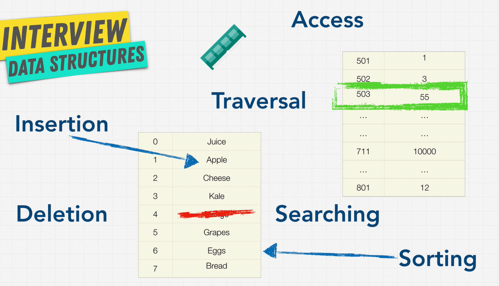
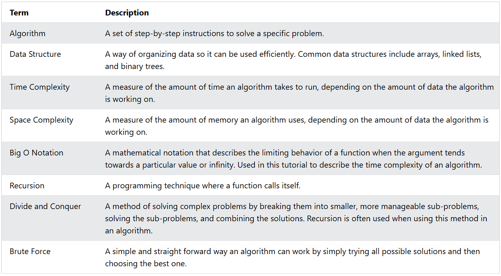

# Data Structures and Algorithms

## What are Data Structures?

**English**:  
Data structure is a storage that is used to store and organize data.
It is a way of arranging data on a computer so that it can be accessed and updated efficiently.
Each data structure is good and is specialized for its own thing.

**Tiếng Việt**:  
Cấu trúc dữ liệu là một kho lưu trữ được sử dụng để lưu trữ và tổ chức dữ liệu.
Đó là cách sắp xếp dữ liệu trên máy tính để có thể truy cập và cập nhật hiệu quả.
Mỗi cấu trúc dữ liệu đều tốt và chuyên biệt cho công việc riêng của nó.

## Operations On Data Structures

## Các Thao Tác Trên Cấu Trúc Dữ Liệu

**English**:

- **Insertion**: Add a new data item in a given collection of items such as adding the apple item in memory.
- **Deletion**: Delete data such as removing mango from our list.
- **Traversal**: Accessing each data item exactly once so that it can be processed.
- **Searching**: Finding out the location of a data item if it exists in a given collection.
- **Sorting**: Having data that is sorted.
- **Access**: How we access the data that we have on our computer.

## Types of Data Structures

## Các Loại Cấu Trúc Dữ Liệu

**English**:  
In Computer Science there are two different kinds of data structures:

1. **Primitive Data Structures** are basic data structures provided by programming languages to represent single values:

   - Integers
   - Floating-point numbers
   - Characters
   - Booleans

2. **Abstract Data Structures** are higher-level data structures that are built using primitive data types and provide more complex and specialized operations. Some common examples include:
   - Arrays
   - Linked lists
   - Stacks
   - Queues
   - Trees
   - Graphs

**Tiếng Việt**:  
Trong Khoa học Máy tính có hai loại cấu trúc dữ liệu khác nhau:

1. **Cấu trúc Dữ liệu Nguyên thủy (Primitive)** là các cấu trúc dữ liệu cơ bản được cung cấp bởi ngôn ngữ lập trình để biểu diễn các giá trị đơn:

   - Số nguyên (Integers)
   - Số thực (Floating-point numbers)
   - Ký tự (Characters)
   - Boolean (Booleans)

2. **Cấu trúc Dữ liệu Trừu tượng (Abstract)** là các cấu trúc dữ liệu cấp cao hơn được xây dựng bằng các kiểu dữ liệu nguyên thủy và cung cấp các thao tác phức tạp và chuyên biệt hơn. Một số ví dụ phổ biến bao gồm:
   - Mảng (Arrays)
   - Danh sách liên kết (Linked lists)
   - Ngăn xếp (Stacks)
   - Hàng đợi (Queues)
   - Cây (Trees)
   - Đồ thị (Graphs)

## What are Algorithms?

## Thuật Toán là gì?

**English**:  
An algorithm is a set of step-by-step instructions to solve a given problem or achieve a specific goal.
Algorithms are understood as methods of processing represented data objects to produce desired results.

**Tiếng Việt**:  
Thuật toán là một tập hợp các hướng dẫn từng bước để giải quyết một vấn đề cụ thể hoặc đạt được một mục tiêu nhất định.
Thuật toán được hiểu là các phương pháp xử lý đối tượng dữ liệu được biểu diễn để tạo ra kết quả mong muốn.

## Data Structures together with Algorithms (DSA)

## Cấu trúc Dữ liệu kết hợp với Thuật toán (DSA)

**English**:  
DSA is about finding efficient ways to store and retrieve data, to perform operations on data, and to solve specific problems.

