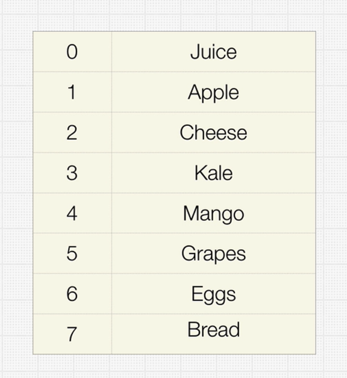
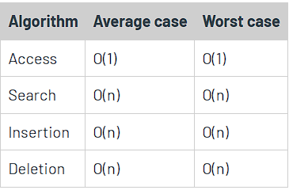

# 🗂️ Arrays

## 📖 Definition

An **array** is a collection of items of the same data type stored at **contiguous (one after another) memory locations**.

Arrays are probably the **simplest and most widely used data structures**, and also have the **smallest memory footprint** compared to other structures.

✅ **Use case**: Arrays are the best option if all you need to do is **store data and iterate over it**.

---

## ⏱️ Time & Space Complexity

* **Space Complexity**:

  * Worst case: `O(n)`

---

## 🧩 Types of Arrays

### 1. 📌 Static Arrays

* The **size is fixed** when created.
* Memory is allocated **once** and cannot change later.
* Contents can be modified, but memory allocation remains constant.

---

### 2. 📌 Dynamic Arrays *(to be added)*

*(You can describe `ArrayList` in Java or `List<T>` in C# here — resizable arrays that manage memory automatically.)*

---
