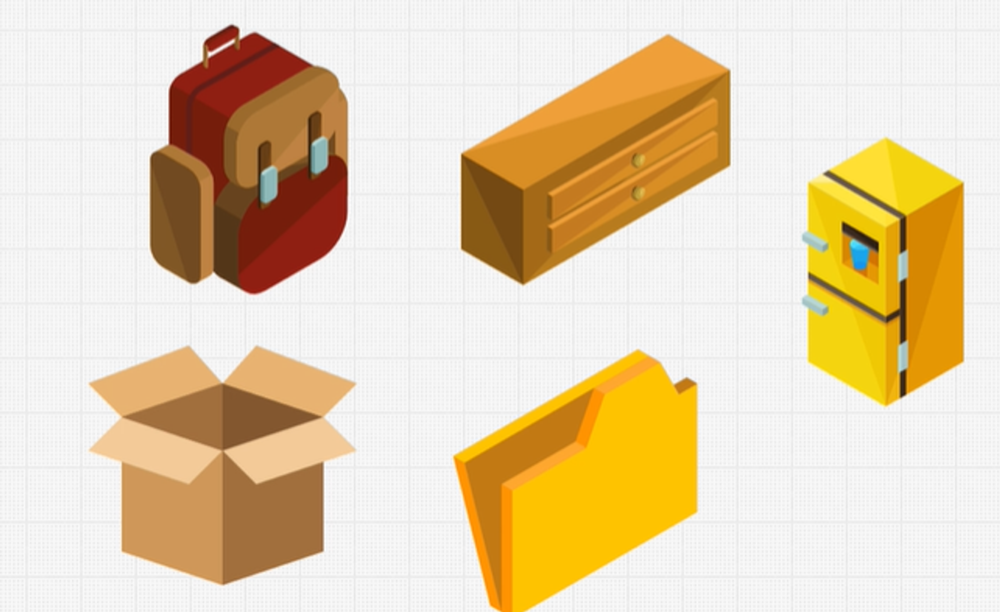
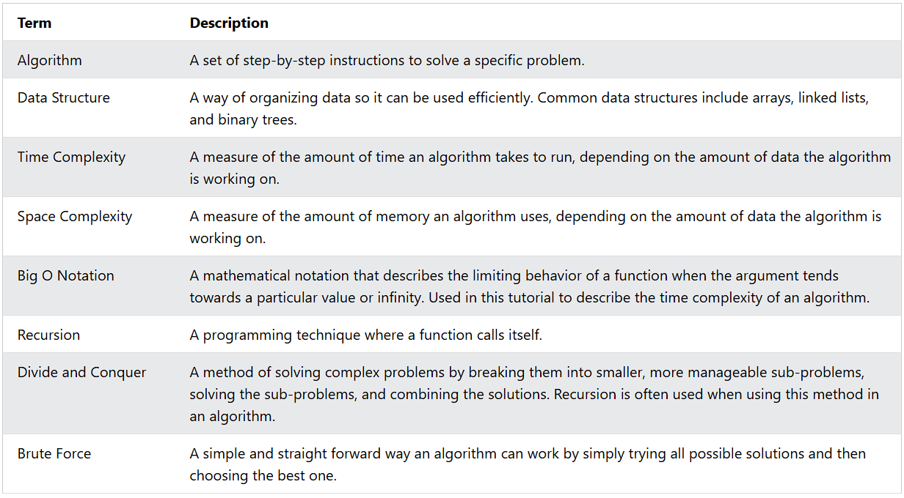

# Data Structures and Algorithms

## What are Data Structures?
  
Data structure is a storage that is used to store and organize data.
It is a way of arranging data on a computer so that it can be accessed and updated efficiently.
Each data structure is good and is specialized for its own thing.

## Operations On Data Structures

- **Insertion**: Add a new data item in a given collection of items such as adding the apple item in memory.
- **Deletion**: Delete data such as removing mango from our list.
- **Traversal**: Accessing each data item exactly once so that it can be processed.
- **Searching**: Finding out the location of a data item if it exists in a given collection.
- **Sorting**: Having data that is sorted.
- **Access**: How we access the data that we have on our computer.

## Types of Data Structures

In Computer Science there are two different kinds of data structures:

1. **Primitive Data Structures** are basic data structures provided by programming languages to represent single values:

   - Integers
   - Floating-point numbers
   - Characters
   - Booleans

2. **Abstract Data Structures** are higher-level data structures that are built using primitive data types and provide more complex and specialized operations. Some common examples include:
   - Arrays
   - Linked lists
   - Stacks
   - Queues
   - Trees
   - Graphs

## What are Algorithms?
  
An algorithm is a set of step-by-step instructions to solve a given problem or achieve a specific goal.
Algorithms are understood as methods of processing represented data objects to produce desired results.

## Data Structures together with Algorithms (DSA)
  
DSA is about finding efficient ways to store and retrieve data, to perform operations on data, and to solve specific problems.

