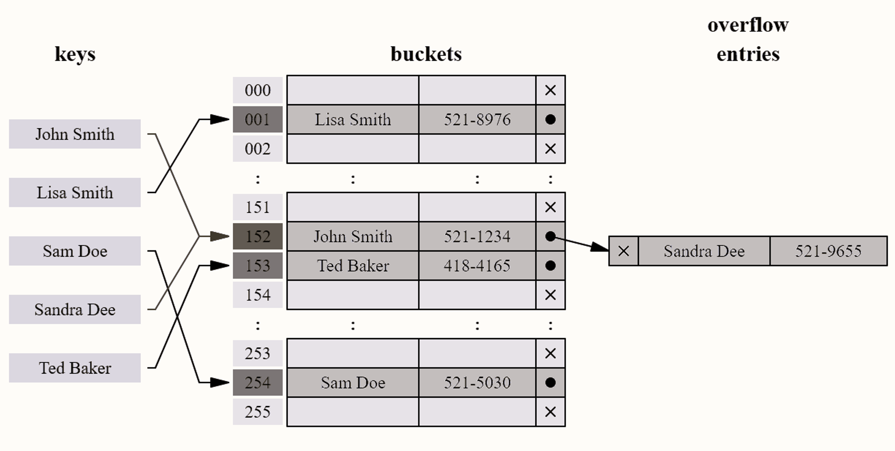
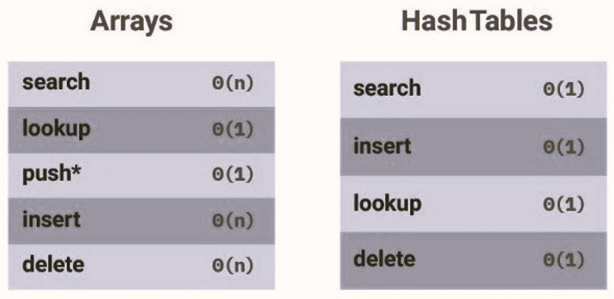

# 🗂️ Hash Tables

## 📖 Definition

A **hash table** is a data structure that stores **key-value pairs**.
Each key is sent through a **hash function**, which computes a numerical value (called a **hash value**) that determines **where** the value will be stored in memory.

```plaintext
        ┌────────────┐
Key ───►│ Hash Func  │──► Index ─► [ Key | Value ]
        └────────────┘
```


✅ **Use case:** Ideal for **fast data lookups**, **associative arrays**, or **key-based retrieval**.

---

## 🧩 Key Concepts

| Term              | Description                                     |
| ----------------- | ----------------------------------------------- |
| **Key**           | A unique identifier used for indexing values.   |
| **Value**         | The data associated with a key.                 |
| **Hash Function** | A function that maps keys to indices.           |
| **Hash Value**    | The computed index result of the hash function. |
| **Collision**     | When two keys hash to the same index.           |

---

## 🔢 What is a Hash Function?

A **hash function** takes input (a key) and maps it to a fixed-length number — called a **hash value** or simply a **hash**.

It’s used for:

* Fast **indexing** and **data retrieval**
* **Encryption** and message digest creation

🔍 **Example:**

```cpp
Key:   "apple"
Hash:  298374
Index: 298374 % 10 = 4  → stored at index 4
```

### 💡 Characteristics of a Good Hash Function:

* Uniformly distributes keys
* Fast to compute
* Produces minimal collisions

---

## ⚠️ Collisions

A **collision** occurs when two keys are hashed to the same index.
Example:

```cpp
hash("apple") = 4
hash("grape") = 4   ❌ Collision!
```



There are several strategies to handle collisions:

---

### 🧱 1. Linear Probing

If a slot is already taken, search **linearly** for the next empty slot.

```cpp
Index: 0 1 2 3 4 5 6
Value: A B   C D   E
                 ↑
           Collision found
           next free slot = 5
```

#### **Python Example**

```python
# Create an empty table with 5 slots
table = [None] * 5
# Sample keys to insert
keys = ["A", "B", "C"]

# Hash function: convert character to ASCII, then take modulo table size
def hash_func(key):
    return ord(key) % len(table)

# Insert keys using linear probing
for key in keys:
    index = hash_func(key)              # Compute index for the key
    while table[index] is not None:     # If occupied, move to next slot
        index = (index + 1) % len(table)
    table[index] = key                  # Place key into the free slot

print(table)  # Display final hash table layout
```

#### **C Example**

```c
#include <stdio.h>
#define SIZE 5

// Hash function that returns the modulo of the key
int hash(int key) { return key % SIZE; }

int main() {
    int table[SIZE] = {0};      // Initialize hash table with zeros
    int keys[] = {10, 20, 30};  // Keys to insert
    int n = 3;                  // Number of keys

    for (int i = 0; i < n; i++) {
        int index = hash(keys[i]);      // Compute hash index
        while (table[index] != 0) {     // If slot is occupied → find next one
            index = (index + 1) % SIZE; // Linear probing (wrap around)
        }
        table[index] = keys[i];         // Insert key
    }

    // Print final hash table
    for (int i = 0; i < SIZE; i++)
        printf("[%d] = %d\n", i, table[i]);
}
```

---

### 🔗 2. Chaining

Each slot of the table holds a **linked list** of elements that hash to the same index.

```cpp
Index  |  Linked List
0      |  NULL
1      |  → [A] → [C]
2      |  → [B]
3      |  NULL
```

#### **Python Example**

```python
from collections import defaultdict

# Use defaultdict(list) to automatically create empty lists
hash_table = defaultdict(list)

# Hash function: use Python's built-in hash, then modulo table size
def hash_func(key):
    return hash(key) % 5

# Insert key-value pair
def insert(key, value):
    index = hash_func(key)              # Compute index
    hash_table[index].append((key, value))  # Append pair to linked list

# Insert sample data
insert("A", 10)
insert("B", 20)
insert("C", 30)

print(hash_table)  # Print the chained hash table
```

#### **C++ Example**

```cpp
#include <iostream>
#include <list>
#include <vector>
using namespace std;

class HashTable {
    int size;                                    // Table size
    vector<list<pair<int, int>>> table;          // Vector of linked lists
public:
    HashTable(int s): size(s), table(s) {}       // Constructor
    int hashFunc(int key) { return key % size; } // Simple modulo hash

    // Insert key-value pair into hash table
    void insertItem(int key, int value) {
        int index = hashFunc(key);               // Compute index
        table[index].push_back({key, value});    // Add pair to the linked list
    }

    // Display all key-value pairs
    void display() {
        for (int i = 0; i < size; i++) {
            cout << i << ": ";
            for (auto &p : table[i])
                cout << "[" << p.first << "," << p.second << "] ";
            cout << endl;
        }
    }
};

int main() {
    HashTable ht(5);         // Create a table with 5 slots
    ht.insertItem(1, 100);   // Insert (1,100)
    ht.insertItem(6, 200);   // Insert (6,200) → same index as 1 (collision)
    ht.display();            // Display all lists
}
```

---

### 🪣 3. Resizing the Hash Table

When too many elements are inserted (i.e., the **load factor** exceeds a threshold),
the table **resizes** (usually doubles its size).

> Example: Threshold = 0.6
> Resize when 60% of the table is full.

⚠️ **Trade-off:** Faster access, but higher memory usage.

---

## 🧮 Time and Space Complexity

| Operation | Average | Worst Case |
| --------- | ------- | ---------- |
| Search    | `O(1)`  | `O(n)`     |
| Insertion | `O(1)`  | `O(n)`     |
| Deletion  | `O(1)`  | `O(n)`     |
| Space     | `O(n)`  | `O(n)`     |

---

## ⚙️ When to Use a Hash Table

✅ **Good at:**

* Fast lookups (`O(1)`)
* Fast inserts
* Flexible key types (string, number, etc.)
* Quick data retrieval with unique keys

❌ **Bad at:**

* Unordered storage
* Slow key iteration
* Memory overhead (especially when resized)

---

## ⚖️ Hash Tables vs Arrays

| Feature         | Hash Table                   | Array                    |
| --------------- | ---------------------------- | ------------------------ |
| Access by Index | ❌ (via key)                  | ✅                        |
| Search          | `O(1)`                       | `O(n)`                   |
| Insert/Delete   | Fast                         | Slow (requires shifting) |
| Order           | Unordered                    | Ordered                  |
| Keys            | Flexible (string, int, etc.) | Numeric only             |



---

## ⚠️ Important Note

Choosing the **right data structure** is crucial for application performance.

> Having a lookup operation with `O(n)` complexity in a **real-time system** that handles large datasets can **break** your product’s responsiveness.

Always **test and validate** performance decisions in your design.
