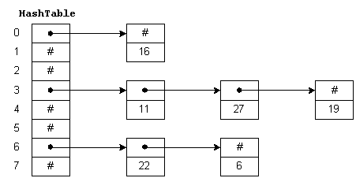
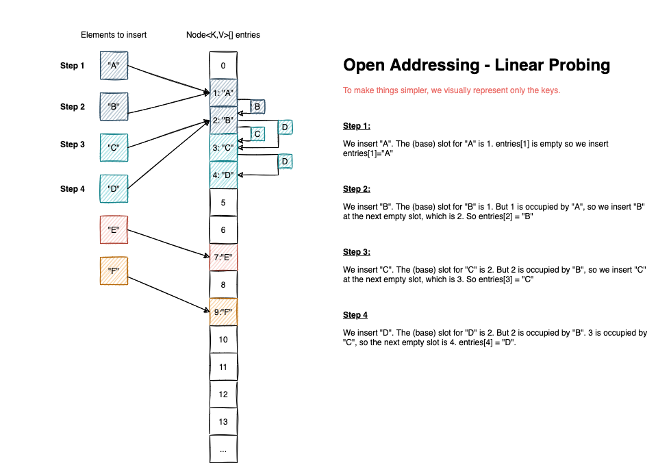
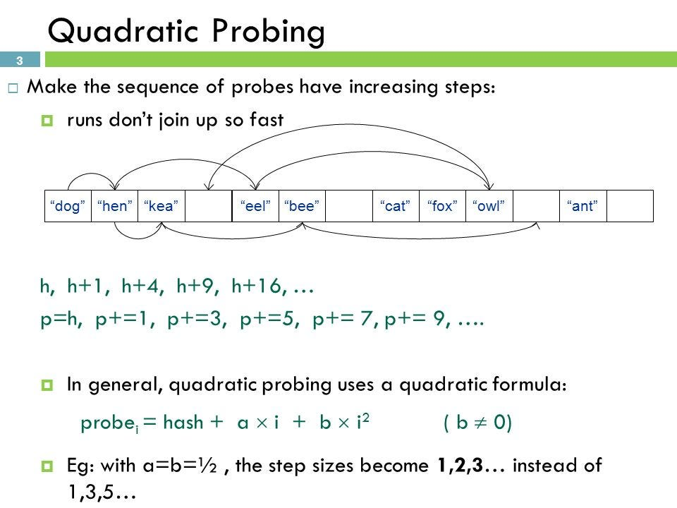
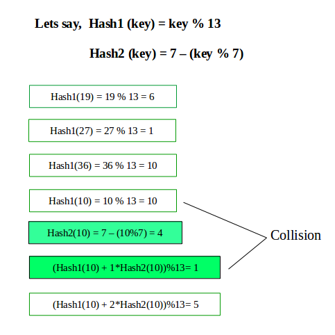

# 📘 Hash Tables – Open Addressing vs Chaining

## 1. Recap: What is Chaining in Hash Tables?

In a **chaining-based hash table**:

* Each slot (bucket) does **not store a single element**
* Instead, it stores a **list (usually a linked list)** of key–value pairs
* Collisions are handled by appending items to the list

```cpp
Table[i] → [(k1, v1), (k2, v2), ...]
```

---



---

### Advantages

* The table never truly becomes “full”
* Insertions are always possible

### Disadvantages

* ❌ High memory overhead (lists, pointers)
* ❌ Some buckets may grow very large → slow lookup
* ❌ Many empty buckets → wasted space

👉 **Key question:** Can we use that wasted empty space more efficiently?

---

## 2. Open Addressing – Core Idea

**Open Addressing** removes chaining entirely.

> Each slot in the hash table stores **at most one key–value pair**.

```cpp
Table[i] = (key, value) | EMPTY
```

* No lists
* No external memory structures
* All keys live **inside the table itself**

👉 Collision resolution happens by **placing the key in another slot**.

---

## 3. What is a Collision in Open Addressing?

A collision occurs when:

* `h(key) = j`
* Slot `j` is already occupied by another key

Since we cannot chain, we must **search for an alternative slot**.

---

## 4. Probe Sequence

A **probe sequence** is a predefined sequence of alternative slots that are checked when a collision occurs.

### Example (Linear Probing)

```cpp
j, j+1, j+2, j+3, ... (mod m)
```

* If the index exceeds the table size, wrap around using modulo
* If no empty slot is found → **rehash**

---

## 5. Insertion in Open Addressing

**Insert(key, value):**

1. Compute `j = h(key)`
2. If `Table[j]` is EMPTY → insert
3. Otherwise, follow the probe sequence
4. Insert into the **first EMPTY slot** encountered

👉 All data stays inside the table

---

## 6. Lookup in Open Addressing (Critical Concept)

**Lookup(key):**

1. Compute `j = h(key)`
2. Check `Table[j]`

   * If key matches → FOUND
   * Otherwise → continue probing
3. Follow the probe sequence
4. Stop **only when an EMPTY slot is found**

### Important Rule

> 🔑 Encountering an EMPTY slot means the key **does not exist** in the table.

Why?

* If the key had existed, it would have been placed **before** that empty slot during insertion.

---

## 7. Types of Probing Strategies

### 7.1 Linear Probing

```cpp
j, j + a, j + 2a, j + 3a, ... (mod m)
```

* Simple
* Easy to implement
* ❌ Causes **clustering**

---



---

### 7.2 Quadratic Probing

```cpp
j, j + 1², j + 2², j + 3², ... (mod m)
```

* Produces a more scattered access pattern
* Reduces clustering

---



---

### 7.3 Double Hashing

Uses two hash functions:

```cpp
h1(key) → initial position
h2(key) → step size
```

Probe sequence:

```cpp
h1
h1 + h2
h1 + 2h2
h1 + 3h2
```

* Very effective
* Strongly reduces clustering

---



---

## 8. The Deletion Problem in Open Addressing

### ❌ Naive Deletion (Bug)

If deletion is implemented as:

```cpp
Table[i] = EMPTY
```

This **breaks probe sequences** and causes lookup failures.

---

### Example Failure

* Key A → slot j
* Key B → slot j+1
* Key C → slot j+2

Delete B → `Table[j+1] = EMPTY`

Lookup C:

* j → not C
* j+1 → EMPTY → stop ❌

Key C is incorrectly reported as missing.

---

## 9. Correct Deletion: Tombstones (DELETED Marker)

Instead of EMPTY, use a special marker:

```cpp
Table[i] = DELETED
```

* DELETED ≠ EMPTY
* Lookup continues past DELETED
* Insertions may reuse DELETED slots

👉 This preserves probe sequences correctly.

---

## 10. Chaining vs Open Addressing

| Feature            | Chaining     | Open Addressing |
| ------------------ | ------------ | --------------- |
| Collision handling | Linked lists | Probing         |
| Memory usage       | High         | Compact         |
| Can fill up        | No           | Yes             |
| Rehashing          | Rare         | Required        |
| Deletion           | Easy         | Requires marker |
| Cache locality     | Poor         | Excellent       |
| Clustering         | No           | Yes             |

---

## 11. Cache Locality Advantage

* Open addressing stores data contiguously in memory
* CPU caches work very efficiently
* Linear probing can be extremely fast in practice

👉 This is why **CPython dictionaries** use open addressing.

---

## 12. Summary

* **Chaining**

  * Simple
  * Flexible
  * Memory-heavy

* **Open Addressing**

  * More complex
  * Requires careful deletion
  * High performance and cache-friendly

👉 There is no universally best approach.
👉 The choice depends on memory constraints, workload, and access patterns.
