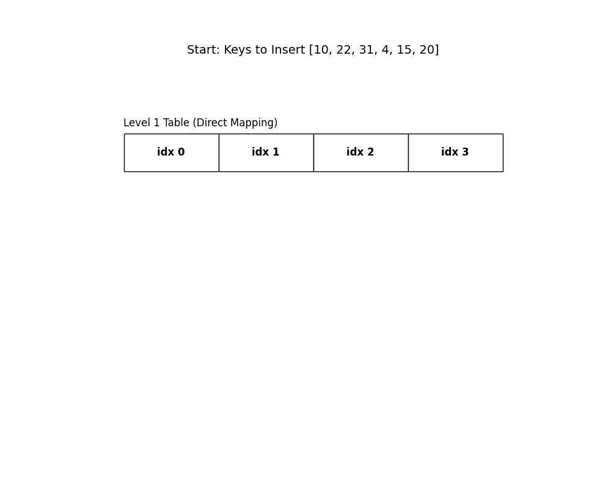
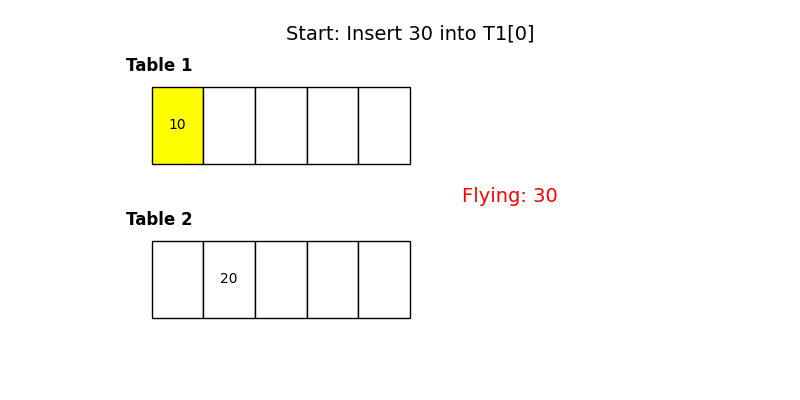

# 🧠 Perfect Hashing & Cuckoo Hashing

---

## ✨ Lecture Overview

In this lecture, we study **two advanced hashing techniques** that aim to overcome the limitations of traditional hashing:

* 🟢 **Perfect Hashing** — guarantees **no collisions** (given all keys upfront)
* 🐦 **Cuckoo Hashing** — guarantees **Θ(1) worst-case lookup time**

These techniques go beyond chaining and open addressing, using probability, randomness, and clever structure to achieve strong guarantees.

---

## ❓ Why Is Hashing Not Perfect?

Traditional hash tables suffer from **collisions**:

* Multiple keys map to the same slot
* Must resolve using:

  * Chaining
  * Open addressing

⚠️ **Worst-case problem**:
If an adversary knows your hash function, they can force many collisions, degrading performance.

---

## 🎲 Universal Hash Functions (Quick Recap)

A **universal hash family** is a *set of hash functions* with this property:

> For any two distinct keys `kᵢ ≠ kⱼ`, the probability they collide (over random choice of hash function) is ≤ **c / m**

Where:

* `m` = number of hash table slots
* `c` = small constant (often 1)

💡 Randomness comes from **choosing the hash function**, not from the keys.

---

## 📊 Expected Behavior with Chaining

If:

* `n` = number of keys
* `m` = number of slots
* `α = n / m` = load factor

Then:

* Average chain length ≈ `α + 1`
* Longest chain (with high probability):

```math
Θ(log n / log log n)
```

👍 Good in practice, but:

* ❌ Still not a constant worst case

---

## 🎯 What Does “Perfect” Mean?

Perfect hashing means:

✅ **No collisions at all**
✅ **Θ(1) lookup guaranteed**

We will see **two approaches**:

1. Perfect Hashing (static keys)
2. Cuckoo Hashing (dynamic keys)

---

#  🟢 Perfect Hashing

## 🧩 Problem Setting

Given:

* `n` **distinct keys** `k₁, k₂, …, kₙ`
* All keys are **known upfront**

Goal:

> Build a hash table where **no two keys collide**

⚠️ No insertions or deletions after construction.

---

## 🧪 Naive Perfect Hashing Idea

### Step 1: Huge Hash Table

* Use `m = K · n²` slots
* Choose a random hash function from a universal family

### Step 2: Insert All Keys

* If **any collision occurs** → abort and retry with a new hash function

---

## 📐 Why This Works (Probability Intuition)

* Probability two keys collide: `≤ c / (K · n²)`
* Number of key pairs: `n(n−1)/2`

Using **Boole’s inequality**:

```
P(any collision) ≤ c / (2K)
```

Choose `K = 2c` → collision probability ≤ 1/4

🎲 Expected retries ≈ **4/3** (geometric trial)

✅ Infinite loop is astronomically unlikely

---

## 🚨 Problem: Space Explosion

Example:

* `n = 1,000,000`
* `m = 2n² = 2 × 10¹²` slots ❌

➡️ Totally impractical

---

## 🧠 Solution: Two-Level Perfect Hashing

### 🔹 Level 1: Primary Hash Table

* Size: `n`
* Hash function: `h₁`
* Keys distribute into slots

### 🔹 Level 2: Secondary Hash Tables

For slot `j`:

* Let `nⱼ` = number of keys hashing to slot `j`
* Create a **secondary table** of size `nⱼ²`
* Choose a new random hash function `hⱼ`

📌 This replaces **chaining** with **perfect hashing per slot**

---



---

## 📊 Space Complexity Result

Let:

```math
Total space = Σ nⱼ²
```

✨ Key result:

```math
E[Σ nⱼ²] = O(n)
```

So total space:

* Primary table: `O(n)`
* Secondary tables (expected): `O(n)`

🎉 Perfect hashing with **linear space**!

---

## ✅ Properties of Perfect Hashing

✔ No collisions
✔ Θ(1) worst-case lookup
✔ Linear space (expected)

❌ Keys must be known upfront
❌ No insert / delete support

---

# 🐦 Cuckoo Hashing

## 💡 Motivation

Lift limitations of perfect hashing:

* Support **insertions & deletions**
* Still guarantee **Θ(1) lookup time**

---

## 🧠 Core Idea

Use:

* **Two hash tables**
* **Two hash functions** `h₁`, `h₂`

Each key `k` can be stored in:

```cpp
Table1[h₁(k)]  OR  Table2[h₂(k)]
```

---

## 🔍 Lookup Operation

```cpp
Check Table1[h₁(k)]
If not found → check Table2[h₂(k)]
```

✅ Always **2 probes** → Θ(1) worst-case

---

## ➕ Insertion (The “Cuckoo” Step)

1. Try `Table1[h₁(k)]`
2. If occupied → kick out existing key
3. Insert displaced key into its *other* table
4. Continue displacement chain

🐦 Like a cuckoo bird pushing eggs out of nests

---



---

## 🔁 Displacement Chains

Possible outcomes:

* ✅ Chain finds empty slot → success
* ⚠️ Chain becomes too long
* ❌ Cycle detected

➡️ If too many displacements:

🔄 **Rehash entire table** with new hash functions

---

## ⏱️ Complexity Summary

| Operation | Complexity      |
| --------- | --------------- |
| Lookup    | Θ(1) worst-case |
| Delete    | Θ(1)            |
| Insert    | Θ(1) expected   |
| Rehash    | Rare, amortized |

📌 Analysis is complex but guarantees are strong

---

## 🆚 Perfect Hashing vs Cuckoo Hashing

| Feature            | Perfect Hashing | Cuckoo Hashing     |
| ------------------ | --------------- | ------------------ |
| Collisions         | None            | None during lookup |
| Lookup             | Θ(1)            | Θ(1)               |
| Insert/Delete      | ❌               | ✔                  |
| Keys known upfront | ✔               | ❌                  |
| Complexity         | Easier          | Harder             |

---

## 🧠 Final Takeaways

* **Perfect Hashing** achieves absolute collision freedom for static data
* **Cuckoo Hashing** enables dynamic hashing with guaranteed fast lookup
* Both rely on:

  * Randomized hash functions
  * Clever probabilistic guarantees

🚀 These are among the most elegant ideas in hashing theory