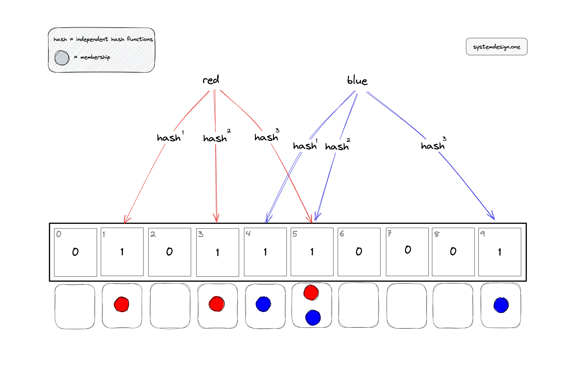
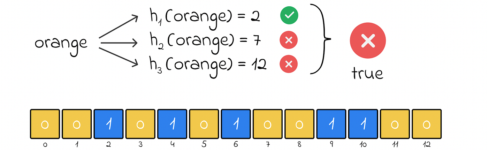
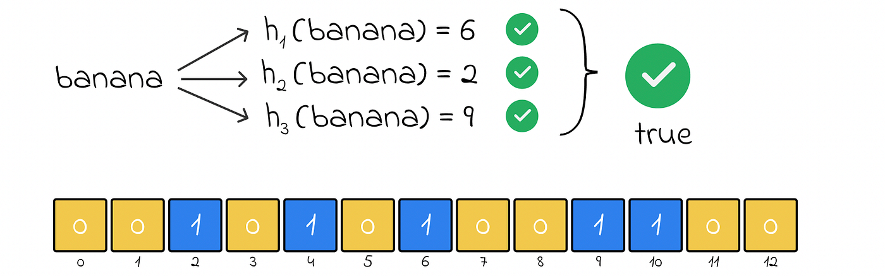
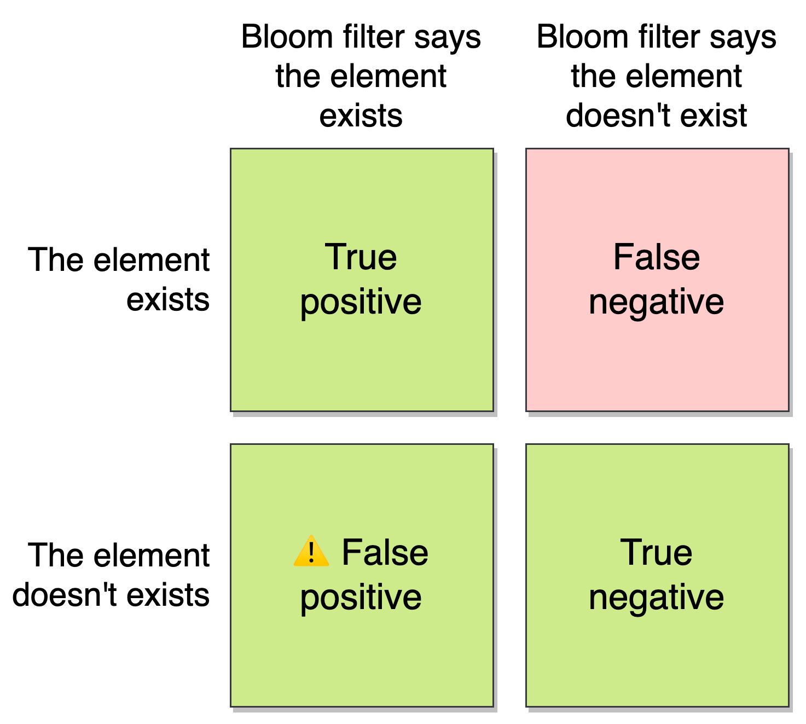

# Bloom Filters

## 1. Introduction

Bloom filters are a probabilistic data structure designed for **fast set membership testing**. They allow you to efficiently answer the question:

> "Is element *x* in the set?"

Bloom filters trade **accuracy for space and speed**. They are widely used in systems such as databases, web caches, distributed systems, and networking.

A Bloom filter was introduced by **Burton Howard Bloom** and is one of the most successful applications of **hashing** beyond traditional hash tables.

---

## 2. What Problem Does a Bloom Filter Solve?

A Bloom filter maintains a set of elements:

```math
{x₁, x₂, ..., xₙ}
```

It supports two operations:

* **Insert(x)** – add an element to the set
* **Query(x)** – check whether an element is in the set

### Important Properties

* If the Bloom filter says **"NO"**, the element is **definitely not** in the set.
* If the Bloom filter says **"YES"**, the element **may be** in the set.

This means:

* ❌ **False negatives are impossible**
* ⚠️ **False positives are possible**

---

## 3. Bloom Filter Data Structure

A Bloom filter consists of:

1. A **bit array** of size `m`

   * Each position is either `0` or `1`
2. `k` **independent hash functions**:

```math
h₁(x), h₂(x), ..., hₖ(x)
```

Each hash function maps a key to a position:

```math
0 ≤ hᵢ(x) < m
```

---

## 4. Insertion Operation

To insert an element `x`:

1. Compute all `k` hash values:

```math
h₁(x), h₂(x), ..., hₖ(x)
```

2. Set the corresponding `k` bits in the bit array to `1`

### Key Idea: Signature

The **signature** of an element is the set of `k` bit positions that are set to `1` due to inserting that element.

---



---

## 5. Membership Query

To check whether an element `x` belongs to the set:

1. Compute the same `k` hash values
2. Check the `k` corresponding bits

* If **any bit is `0`** → element is **definitely not** in the set
* If **all bits are `1`** → element **may be** in the set

---



---



---

## 6. Why False Positives Occur

False positives happen because:

* Multiple elements may set the same bits
* Different elements can accidentally produce the same signature

Even if `x` was never inserted, its `k` hash positions may all be `1` due to other insertions.

This is an intentional trade-off for:

* Extremely low memory usage
* Constant-time operations

---

---

## 7. Time and Space Complexity

### Time Complexity

* Insert: **O(k)**
* Lookup: **O(k)**

(`k` is typically small and constant)

### Space Complexity

* Uses only `m` bits total
* Often described as using **a few bits per element**, regardless of element size

---

## 8. False Positive Probability Analysis

Let:

* `n` = number of inserted elements
* `m` = number of bits in the Bloom filter
* `k` = number of hash functions

### Probability a Bit Is Still Zero

After inserting `n` elements:

```math
P(bit = 0) ≈ e^(−kn/m)
```

### Probability a Bit Is One

```math
P(bit = 1) = 1 − e^(−kn/m)
```

### Probability of a False Positive

```math
P(false positive) ≈ (1 − e^(−kn/m))^k
```

> This analysis assumes independence between bits, which is not perfectly true but works well in practice.

---

## 9. Example Calculation

Assume:

* `n = 5,000` elements
* `m = 25,000` bits (≈ 5 bits per element)
* `k = 3` hash functions

False positive probability:

```math
P ≈ (1 − e^(−3×5000 / 25000))^3 ≈ 0.09
```

➡️ About **9% false positives**, which is acceptable in many systems.

Increasing `m` or choosing an optimal `k` reduces this probability.

---

## 10. Advantages of Bloom Filters

✅ Extremely space-efficient

✅ Very fast insert and lookup

✅ No false negatives

✅ Simple implementation

---

## 11. Limitations

❌ False positives possible

❌ Cannot delete elements (without variants like Counting Bloom Filters)

❌ Does not store actual elements

---

## 12. Real-World Applications

### Web Caching

Bloom filters are commonly used in **web servers and CDNs**:

* Detect whether a request has been seen before
* Identify **one-hit wonders** (requests unlikely to repeat)
* Avoid polluting limited cache space

### Why False Positives Are Acceptable

* A false positive only causes an unnecessary cache insertion
* No correctness is lost
* Bloom filters can be periodically reset

---

## 13. Summary

Bloom filters are:

* Probabilistic
* Space-efficient
* Hash-based

They are ideal when:

* You need fast membership checks
* Memory is limited
* Occasional false positives are acceptable

They demonstrate how hashing can be used to build powerful data structures beyond traditional hash tables.
