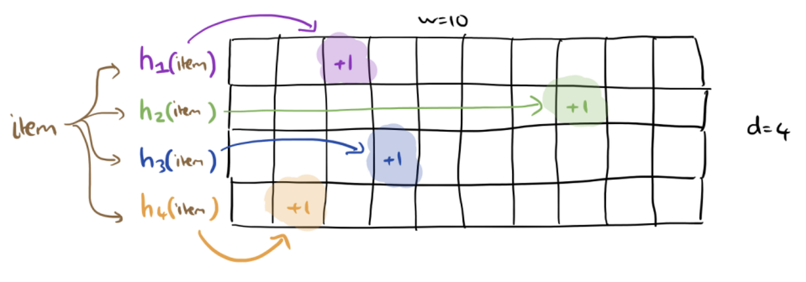
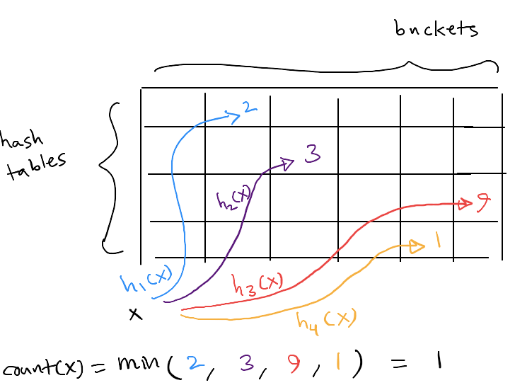
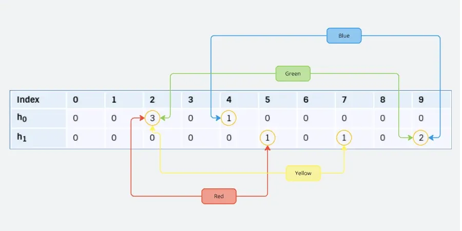

# 📊 Count-Min Sketch (CMS)

## 🎯 What is a Count-Min Sketch?

A **Count-Min Sketch** is a **probabilistic data structure** that uses **hashing** to maintain **approximate frequency counts** of elements in a large data stream.

It is especially useful when:

* The stream is **huge** (millions or billions of items)
* The number of **distinct elements is unknown**
* Exact counting is **too expensive** in memory

Instead of storing exact counters for every distinct element, CMS trades **accuracy for efficiency**, while providing strong probabilistic guarantees.

---

## 🌊 Problem Setup: Counting in Data Streams

We are given a data stream:

```math
x₁, x₂, x₃, …, x_W
```

Where:

* **W** = total number of elements in the stream (can be very large)
* Each element may repeat
* The number of **distinct items (N)** is unknown

### ❓ Query Goal

We want to answer queries like:

> "How many times did element `x` appear in the stream?"

But:

* Exact counts are not required
* An **approximate count** is acceptable

---

## 🎯 Accuracy Guarantee

A Count-Min Sketch guarantees:

```math
ApproxCount(x) ≤ TrueCount(x) + ε · W
```

With probability at least:

```math
1 − δ
```

Where:

* **ε (epsilon)** = error fraction
* **δ (delta)** = failure probability

### 📌 Example

* W = 1,000,000,000 (1 billion)
* ε = 10⁻⁶ → allowable error = 1,000
* δ = 0.01 → 99% confidence

➡️ The reported count is within **±1000** of the true count, **99% of the time**.

---

## 🧠 Core Idea

Count-Min Sketch uses:

* Multiple **hash functions**
* Multiple **arrays of counters** (called *counter banks*)

Each incoming element updates **one counter per bank**.

---

## 🧱 Data Structure Layout

* **k** counter banks
* Each bank has **m counters**
* Each bank has its **own independent hash function**

```cpp
Bank 1: [ c₁₁ c₁₂ c₁₃ ... c₁m ]  ← h₁(x)
Bank 2: [ c₂₁ c₂₂ c₂₃ ... c₂m ]  ← h₂(x)
...
Bank k: [ ck₁ ck₂ ck₃ ... ckm ]  ← h_k(x)
```

---

## ➕ Insert Operation

For each incoming stream element `x`:

```cpp
for i = 1 to k:
    index = hᵢ(x)
    counter_bank[i][index] += 1
```

⏱️ Time complexity: **O(k)**

---



---

## 🔍 Query Operation

To estimate the count of element `x`:

```cpp
return min(
    counter_bank[1][h₁(x)],
    counter_bank[2][h₂(x)],
    ...,
    counter_bank[k][h_k(x)]
)
```

### 🤔 Why take the minimum?

Each counter may **overestimate** due to hash collisions.

Taking the **minimum** gives:

* The **least overestimated** value
* Best approximation of the true count

> 💡 Analogy: Asking multiple vendors for a price — all overcharge, so you pick the lowest one.

---



---

## ⚠️ Why Counts Are Approximate

Because:

* Multiple elements can hash to the **same counter**
* Counters accumulate **extra increments**

➡️ Errors are always **positive** (overestimation only)

❌ No underestimation

---



---

## 📐 Error Analysis (High Level)

### Expected Error (Single Bank)

```math
E[error] ≤ (C / m) · W
```

Where:

* C ≈ 1 (from universal hashing)
* m = number of counters per bank

### Choosing m

To bound error ≤ ε·W:

```math
m ≈ e · C / ε
```

This guarantees:

```math
P(error ≥ ε·W) ≤ 1/e
```

---

## 🔁 Reducing Error with Multiple Banks

We use **k independent banks**.

* Each bank fails with probability ≤ 1/e
* All k banks fail with probability:

```math
(1/e)ᵏ
```

To achieve confidence ≥ 1 − δ:

```math
k ≥ ln(1 / δ)
```

➡️ Error probability decreases **exponentially** with k

---

## 🧮 Parameter Summary

| Parameter | Meaning                               |
| --------- | ------------------------------------- |
| m         | Counters per bank (controls accuracy) |
| k         | Number of banks (controls confidence) |
| ε         | Error tolerance                       |
| δ         | Failure probability                   |

---

## 🧪 Typical Configuration Example

* W = 10⁹
* ε = 10⁻⁶ (error ≤ 1000)
* δ = 0.1 (90% confidence)

Choose:

* m ≈ 3,000,000
* k ≈ 3

Total counters ≈ 9 million

➡️ Massive memory savings compared to exact counting

---

## ✅ Strengths of Count-Min Sketch

✔ Extremely memory efficient
✔ Fast updates and queries
✔ Works on streaming data
✔ Simple to implement
✔ Strong probabilistic guarantees

---

## ❌ Limitations

✘ Counts are approximate
✘ Overestimation only
✘ Cannot list all items
✘ Requires careful parameter tuning

---

## 📦 Common Applications

* Web request frequency counting
* Heavy hitter detection
* Network traffic analysis
* Query frequency estimation
* Log analytics
* Streaming analytics systems

---

## 🔗 Related Data Structures

* Bloom Filter (membership only)
* Counting Bloom Filter
* Cuckoo Filter
* Heavy Hitters (Misra–Gries)

---

## 🧠 Key Takeaway

> **Count-Min Sketch provides fast, space-efficient approximate frequency counting with guaranteed error bounds — ideal for massive data streams.**
