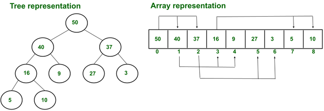
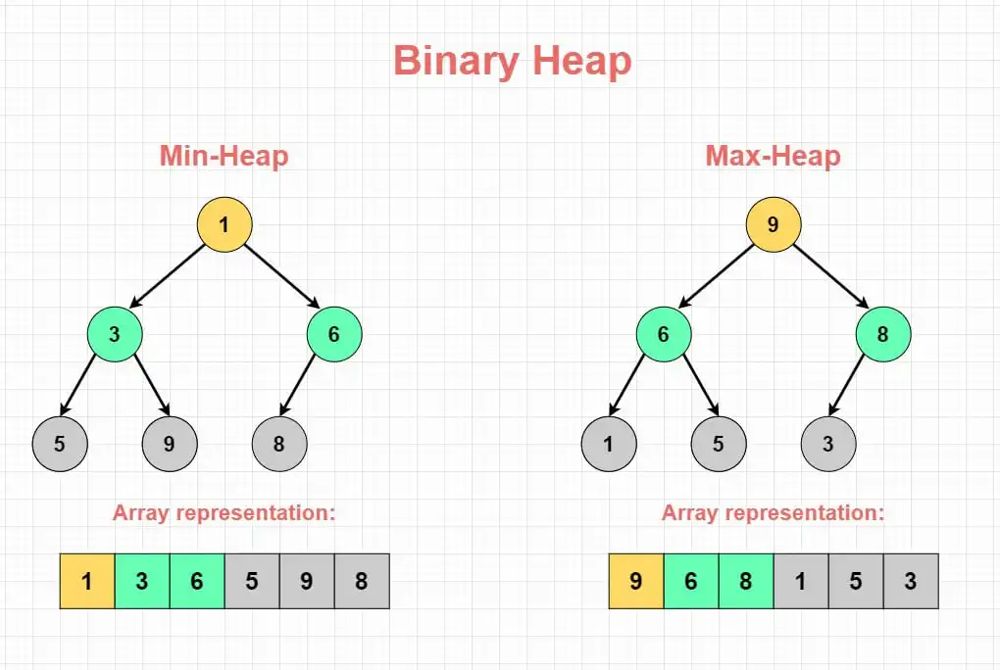

# 🧱 Binary Heaps (Data Structure)

## 1. Introduction

A **Binary Heap** is a special type of **binary tree** that satisfies two key properties:

- **Shape property:** It is a **complete binary tree**, meaning all levels are completely filled except possibly the last level, which is filled from **left to right**.
- **Heap property:** The value of each node is ordered with respect to its children, forming either a **Min-Heap** or a **Max-Heap**.

Heaps are fundamental for **priority queues**, **sorting (Heap Sort)**, and **graph algorithms** like Dijkstra’s shortest path.

---

## 2. Structure and Properties

### 🧩 Shape Property (Completeness)

A Binary Heap must always be a **complete binary tree**, meaning:

- Every level is **fully filled**, except possibly the last.
- The last level’s nodes are added **from left to right**.

📘 **Example — Complete Binary Tree:**

```cpp
            2
         /     \
        4       7
       / \     /
      9   8   10
````

✅ This is a *complete* binary tree.

❌ The following is *not* a complete binary tree (right child missing before leftmost leaf):

```cpp
            2
         /     \
        4       7
         \
          9
```

---

## 3. Heap Property

A **Binary Heap** can be either a **Min-Heap** or a **Max-Heap**.

### 🟢 Min-Heap

- The **key at the root** is the **minimum** among all keys.
- The property must be **recursively true** for all nodes.
- Every parent node is **less than or equal to** its child nodes.

#### 🟢 Example — Min-Heap

```cpp
            2
         /     \
        4       5
       / \     / \
      7   6   18  9
```

- The smallest key (`2`) is at the root.
- Each parent ≤ its children.

### 🔴 Max-Heap

- The **key at the root** is the **maximum** among all keys.
- The property must be **recursively true** for all nodes.
- Every parent node is **more than or equal to** its child nodes.

#### 🔴 Example — Max-Heap

```cpp
            18
         /      \
        12       10
       /  \     /  \
      9    8   6    2
```

- The largest key (`18`) is at the root.
- Each parent ≥ its children.

### 💡 Important

Sibling nodes have **no ordering requirement** between them.

---

## 4. Array Representation

A **Binary Heap** can be efficiently stored in an **array** using **1-based indexing**. This representation allows for quick access to parent and child nodes.

### ⚙️ Animation Resprestaion

---


---

### 📊 Visual Representation

---


---

### 🔗 Parent–Child Relationships

The relationships between parent and child nodes, **For each node A[i]**:

- **Parent(i):** `⌊ i / 2 ⌋`
- **LeftChild(i):** `2i`
- **RightChild(i):** `2i + 1`

This array-based implementation enables **constant-time access** to parent and child nodes, making it highly efficient for heap operations.

---

## 5. Heap Height

Because the tree is **complete**, its height is always:

```math
h = ⌊ log₂(n) ⌋
```

where `n` = number of nodes in the heap.

That means operations like **insert** or **delete** take `O(log n)` time.

---

## 6. Common Heap Operations

| Operation                       | Description                       | Time Complexity |
| ------------------------------- | --------------------------------- | --------------- |
| `insert(x)`                     | Insert a new element              | `O(log n)`      |
| `extractMin()` / `extractMax()` | Remove and return root element    | `O(log n)`      |
| `findMin()` / `findMax()`       | Get root element without removing | `O(1)`          |
| `heapify()`                     | Reorder array into valid heap     | `O(n)`          |
| `delete(i)`                     | Delete element at index `i`       | `O(log n)`      |

---

## 7. Summary Comparison

| Property     | Min-Heap                  | Max-Heap                   |
| ------------ | ------------------------- | -------------------------- |
| Root element | Smallest                  | Largest                    |
| Order rule   | Parent ≤ Children         | Parent ≥ Children          |
| Use case     | Ascending priority queues | Descending priority queues |

---

## 9. Key Insights

💡 **Key Takeaways**

- Binary Heap is a **complete** binary tree, not a BST.
- **Heap property** ensures ordering vertically, not horizontally.
- Array representation allows for **space-efficient** storage.
- Operations like insertion and removal maintain heap structure using **heapify**.
- Slow lookup.


⚙️ **Used in**

- Priority queues
- Heap sort
- Graph algorithms (e.g., Dijkstra’s)

## 10. Binary Heap Example Recap


