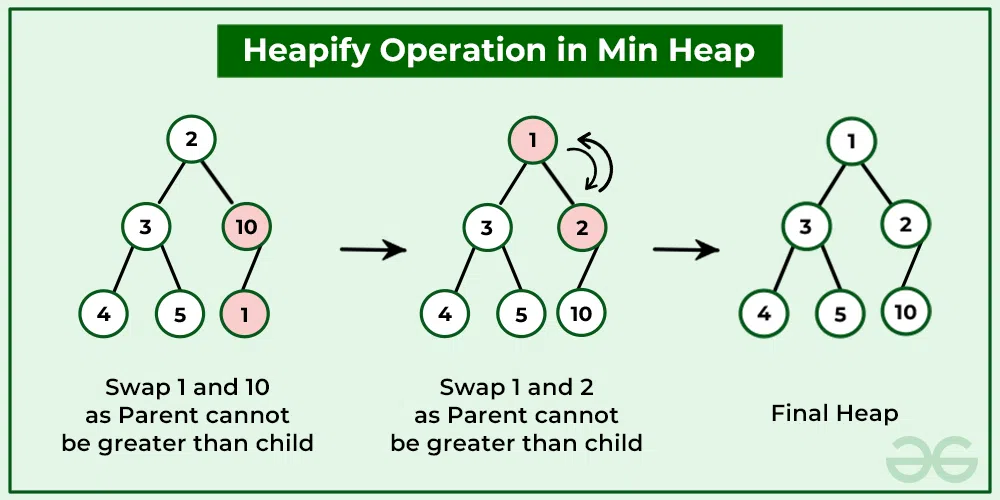

# 🧮 Binary Heap Operations

## Overview

Previously, we defined the **heap properties** and examined how a **min-heap** works — both as an **array** and as a **binary tree**.  
Now we’ll learn about **heap operations**, focusing on:

1. **Inserting elements** into the heap  
2. **Deleting elements** from the heap  
3. **Building a heap** from an array  

To perform these efficiently, we’ll introduce two fundamental primitives:

- **Bubble Up** 🟩  (example in min-heap)
- **Bubble Down** 🟥  (example in max-heap)

These are the building blocks for all heap operations.

---

## 🔼 Bubble Up (a.k.a. Percolate Up) (Ex in Min-Heap)

### When do we use it?

We use **Bubble Up** when the **heap property fails** at a node that is **smaller than its parent** — meaning the node needs to “move up” the tree.

---


---

The image above demonstrates this process:

1. **Add to the End:**  
  The new value (`1`) is inserted at the end of the array and as the rightmost leaf in the tree.

2. **First Bubble Up:**  
  Compare `1` with its parent (`10`). Since `1 < 10`, swap them.

3. **Second Bubble Up:**  
  Now, `1` is compared with its new parent (`2`). Since `1 < 2`, swap again.

After these swaps, `1` has reached its correct position, and the heap property is restored throughout the tree.

✅ Heap property restored.

---

### 🔁 Bubble-Up Concept

> **If a node’s value is smaller than its parent, swap them.**

Repeat recursively until the heap property holds.

---

### 🧠 Pseudocode for Bubble-Up

```python
def bubble_up(A, j):
    if j <= 1:
        return  # Already at root

    parent = j // 2
    if A[j] < A[parent]:
        swap(A, j, parent)
        bubble_up(A, parent)
````

---

### ⏱️ Time Complexity

In the **worst case**, the element bubbles up from a leaf to the root.
Since the heap height is `log₂(n)`, we have:

> **Time complexity:** Θ(log n)

Even with a million elements, only about **20 swaps** are needed.

---

## 🔽 Bubble Down (a.k.a. Percolate Down) (Ex in Max-Heap)

### When do we use it?

We use **Bubble Down** in a **max-heap** when a node is **smaller than one or both of its children** — meaning it needs to move **down the tree** to restore the max-heap property.

Typical case: after deleting the root element or moving an element to the root temporarily.


### Example: Bubble Down in Max-Heap

Root value `44` is deleted. To maintain the complete binary tree structure, the rightmost leaf (`14`) is moved to the root position. However, this violates the **max-heap** property, since `14` is smaller than its children.

The bubble-down process proceeds as follows:

1. **First Bubble Down:**  
  Compare `14` with its two children (`42` and `35`). The largest child is `42`. Since `14 < 42`, swap them.

2. **Second Bubble Down:**  
  Compare `14` with its two children (`33` and `31`). The largest child is `33`. Since `14 < 33`, swap them.

3. **Third Bubble Down:**  
  Compare `14` with its two children (`10` and `26`). The largest child is `26`. Since `14 < 26`, swap them.

After these swaps, `14` has reached its correct position, and the max-heap property is restored throughout the tree.

✅ Heap property restored.

---

### 🧠 Pseudocode for Bubble-Down

```python
def bubble_down(A, i, n):
    left = 2 * i
    right = 2 * i + 1

    # No children → done
    if left > n:
        return

    # One child (left only)
    if right > n:
        if A[i] > A[left]:
            swap(A, i, left)
        return

    # Two children → find smaller one
    smaller = left if A[left] < A[right] else right

    if A[i] > A[smaller]:
        swap(A, i, smaller)
        bubble_down(A, smaller, n)
```

---

### ⏱️ Time Complexity

Similar to **bubble-up**, each swap moves one level down the heap.

> **Time complexity:**  ``Θ(log n)``

---

## 🧩 Summary

| Operation         | Heap Type   | Trigger Condition                                 | Action                                         | Complexity |
| ----------------- | ---------- | ------------------------------------------------- | ---------------------------------------------- | ---------- |
| **Bubble Up**     | Min-Heap   | Node < Parent                                     | Swap upward until heap property is restored    | Θ(log n)   |
| **Bubble Up**     | Max-Heap   | Node > Parent                                     | Swap upward until heap property is restored    | Θ(log n)   |
| **Bubble Down**   | Min-Heap   | Node > One or both children                       | Swap downward with smaller child until fixed   | Θ(log n)   |
| **Bubble Down**   | Max-Heap   | Node < One or both children                       | Swap downward with larger child until fixed    | Θ(log n)   |

## 📘 Next Step

With **bubble-up** and **bubble-down** mastered, we can now efficiently:

- Insert new elements
- Delete the minimum (or maximum)
- Build a heap from an array
- ✅ Insertion = Append + Bubble Up
- ✅ Deletion = Remove Root + Bubble Down

These operations are all built upon these two fundamental procedures.
