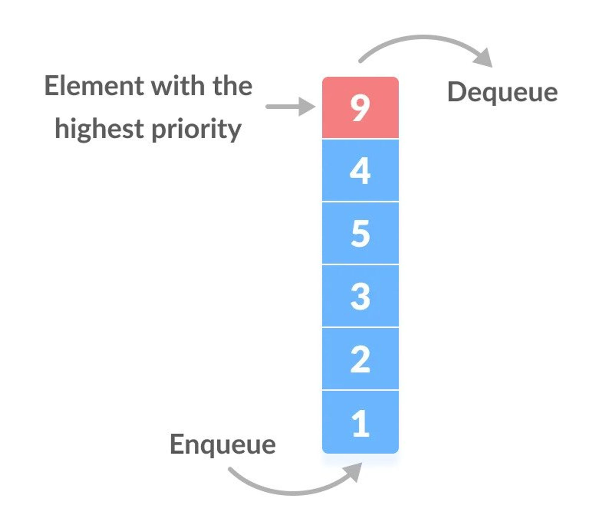

# 🧩 Priority Queue

A **Priority Queue** is a special type of queue where **each element has a priority value**, and elements are **served based on their priority**, not just their insertion order.

---


## ⚙️ Core Concept

* **High-priority elements** are processed **before** lower-priority ones.
* If two elements share the **same priority**, they are processed in **FIFO** (First-In-First-Out) order.

> 📘 *In short:* “Highest priority first, ties resolved by arrival order.”

---

## 🧠 How It Works

| Operation            | Description                                               |
| -------------------- | --------------------------------------------------------- |
| **Insert (Enqueue)** | Add a new request with its priority.                      |
| **Delete (Dequeue)** | Remove and process the element with the highest priority. |

---

## 🧩 Priority Assignment

* Usually, **the value itself** determines the priority.

  * Example: Higher value → higher priority.
* But depending on the context, we can also define:

  * **Lower value → higher priority** (e.g., shortest job first).
* The priority rule is **customizable** based on the problem.

---

## 🆚 Priority Queue vs. Normal Queue

| Feature           | Normal Queue                     | Priority Queue                  |
| ----------------- | -------------------------------- | ------------------------------- |
| **Order Rule**    | FIFO (First In, First Out)       | Based on priority               |
| **Processing**    | Elements served in arrival order | Highest priority served first   |
| **Usage Example** | Line of customers                | CPU scheduling, network packets |

---

## 🧮 Example

Imagine incoming requests with different priorities:

| Request | Priority |
| ------- | -------- |
| A       | Low      |
| B       | High     |
| C       | Medium   |
| D       | Low      |

Processing order:
👉 **B → C → A → D**

Or numerically (max-heap style):

| Value | Priority |
| ----- | -------- |
| 10    | High     |
| 7     | Medium   |
| 3     | Low      |
| 2     | Low      |

Processing order:
👉 **10 → 7 → 3 → 2**

---

## 💻 Common Use Cases

* **Operating system schedulers** (CPU task scheduling)
* **Network packet switching** (urgent packets first)
* **Event-driven simulations**
* **Database query management**

---

## ⚙️ Implementation

Priority queues are often implemented using a **binary heap**:

* **Insertion** → `Append + Bubble Up`
* **Deletion** → `Remove Root + Bubble Down`

---

## 🧾 Pseudocode

```cpp
procedure insert(value):
    add value to the end of heap
    bubbleUp(lastIndex)

procedure bubbleUp(index):
    while index > 0:
        parent = (index - 1) / 2
        if heap[index] > heap[parent]:
            swap(heap[index], heap[parent])
            index = parent
        else:
            break

procedure extractMax():
    if heap is empty:
        return null
    max = heap[0]
    heap[0] = heap[lastIndex]
    remove last element
    bubbleDown(0)
    return max

procedure bubbleDown(index):
    size = heap.length
    while leftChild(index) < size:
        largest = index
        left = 2 * index + 1
        right = 2 * index + 2

        if left < size and heap[left] > heap[largest]:
            largest = left
        if right < size and heap[right] > heap[largest]:
            largest = right

        if largest != index:
            swap(heap[index], heap[largest])
            index = largest
        else:
            break
```

---

## 💡 Example in C++

```cpp
#include <iostream>
#include <queue>
using namespace std;

int main() {
    // max-heap priority queue
    priority_queue<int> pq;

    pq.push(10);
    pq.push(3);
    pq.push(7);
    pq.push(5);

    cout << "Processing order: ";
    while (!pq.empty()) {
        cout << pq.top() << " ";  // highest priority (max) first
        pq.pop();
    }
    return 0;
}
```

🔹 Output:

```cpp
Processing order: 10 7 5 3
```

---

## 🐍 Example in Python

```python
import heapq

# Python uses a min-heap by default, so we invert values for max-heap
pq = []

heapq.heappush(pq, -10)
heapq.heappush(pq, -3)
heapq.heappush(pq, -7)
heapq.heappush(pq, -5)

print("Processing order:", end=" ")
while pq:
    value = -heapq.heappop(pq)
    print(value, end=" ")
```

🔹 Output:

```cpp
Processing order: 10 7 5 3
```

---

🖼️ *(Insert a diagram here — e.g., heap tree visual or priority queue flow chart)*

---

## 🌍 Real-World Examples

### 🖥️ 1. CPU Scheduling

Operating systems use a **priority queue** to determine which process should run next.

* Each process has a priority level (e.g., system tasks > user tasks).
* The scheduler always picks the process with the **highest priority**.
* When a new higher-priority process arrives, it can **preempt** the running one.

```text
Process | Priority  | State
--------|-----------|--------
P1      | High      | Running
P2      | Medium    | Waiting
P3      | Low       | Waiting
```

Processing order: **P1 → P2 → P3**

---

### 🚑 2. Hospital Emergency Room (Triage)

Patients are treated based on **medical urgency**, not arrival order.

* “Critical” patients receive immediate care.
* “Stable” patients wait longer.

```text
Patient | Condition      | Priority
--------|----------------|----------
A       | Minor injury   | Low
B       | Heart attack   | High
C       | Broken arm     | Medium
```

Treatment order: **B → C → A**

---

### 🌐 3. Network Packet Routing

Routers and switches handle data packets using a **priority queue**.

* Voice/video packets (real-time) = high priority
* Background file transfers = low priority

Ensures minimal delay for critical data.

---

### 🗃️ 4. Print Queue in an Office

When multiple print jobs are submitted:

* Admin or urgent documents = higher priority
* Bulk or long reports = lower priority

Result: The most important jobs print first.

---
