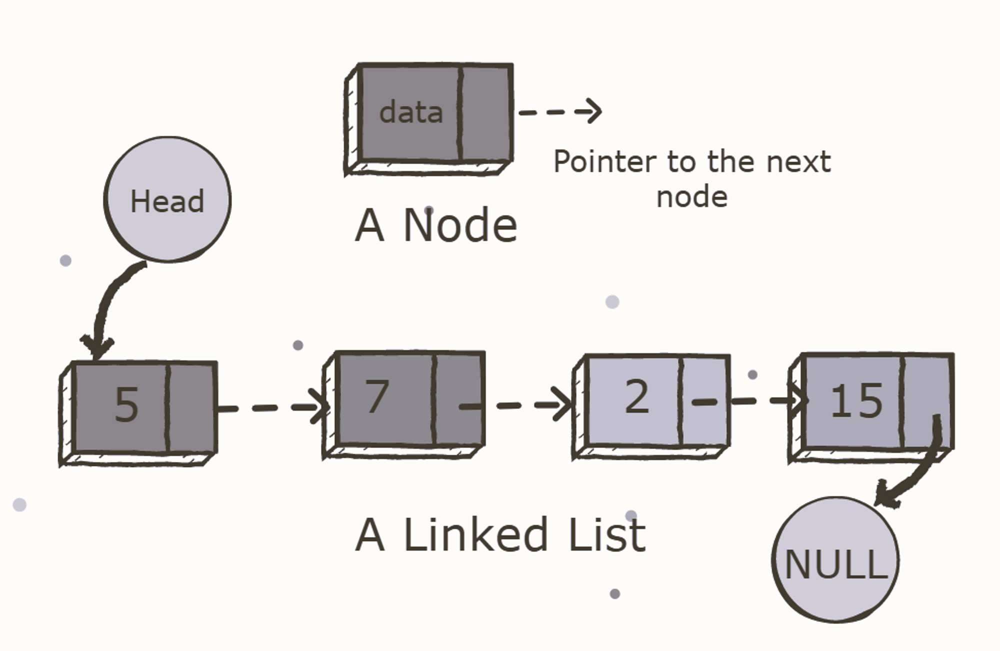
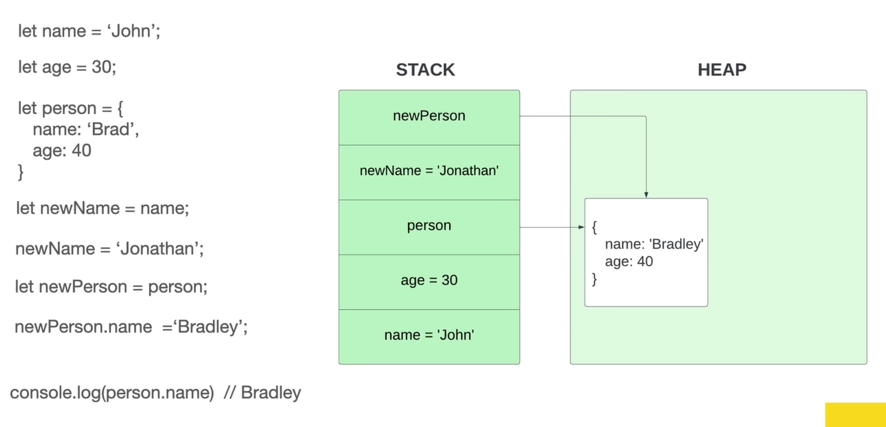
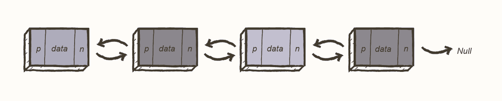

# 🔗 Linked List

## 📌 1. Overview

A **Linked List** is a common **linear data structure** made up of one or more **nodes**. Each node contains:

* 🧱 **Data (value)**
* 👉 **Pointer(s)** to other node(s)

Unlike arrays, linked list nodes are **not stored contiguously** in memory. Instead, they are scattered across memory and connected via pointers.

> 💡 This design allows **dynamic memory allocation** and flexible size management.

---

## 🧠 2. How Linked Lists Work

Each node forms part of a **chain-like structure**:

* The **head** points to the first node
* Each node points to the **next** (and possibly previous) node
* The **tail** points to the last node

📍 Nodes are stored randomly in memory, but pointers preserve logical order.



---

## 👉 3. What Is a Pointer?

A **pointer** is a variable that stores the **memory address** of another value.

* It references a location in memory
* Accessing the value at that location is called **dereferencing**

📘 **Analogy**:

> A page number in a book index is like a pointer.
> Turning to that page is dereferencing.



📌 In many examples, two variables can **point to the same memory location**, meaning changes via one reference affect the other.

---

## ⏱️ 4. Big-O Complexity (Linked List)

| Operation | Time Complexity |
| --------- | --------------- |
| Prepend   | **O(1)**        |
| Append    | **O(1)**        |
| Lookup    | **O(n)**        |
| Insert    | **O(n)**        |
| Delete    | **O(n)**        |

⚠️ Random access is slow because traversal is required.

---

## 🧩 5. Types of Linked Lists

### 🔹 Singly Linked List (SLL)

A **Singly Linked List** allows traversal in **one direction only**.

Each node contains:

* Data
* Pointer to the **next node**

📌 **Limitation**:

* ❌ Cannot traverse backward

📷 **Image Placeholder**: Singly linked list


---

### 🔹 Doubly Linked List (DLL)

A **Doubly Linked List** supports **two-way traversal**.

Each node contains:

* Data
* Pointer to the **next node**
* Pointer to the **previous node**

📷 **Image Placeholder**: Doubly linked list


📌 **Trade-off**:

* ✅ Easier traversal and deletion
* ❌ More memory usage due to extra pointer

---

## 👍 6. Linked Lists Are Good At

* 😀 Fast insertion
* 😀 Fast deletion
* 😀 Ordered structure
* 😀 Flexible size (dynamic)

---

## 👎 7. Linked Lists Are Bad At

* 😒 Slow lookup
* 😒 Higher memory usage
* 😒 More complex reverse logic

---

## 🔁 8. Reversing a Linked List (Concept)

Reversing a linked list involves:

* Iterating through nodes
* Reversing pointer directions
* Updating head and tail

📘 **C Example (Conceptual)**:

```cpp
// Node structure
typedef struct Node {
    int data;
    struct Node* next;
} Node;

// Function to reverse a singly linked list
Node* reverse(Node* head) {
    Node* prev = NULL;
    Node* current = head;
    Node* next = NULL;
    while (current != NULL) {
        next = current->next;
        current->next = prev;
        prev = current;
        current = next;
    }
    return prev; // New head
}
```

---


---

## 📝 9. Summary

* Linked lists use **nodes and pointers** instead of indexes
* Excellent for **dynamic data** and frequent insertions/deletions
* Poor choice for **random access**
* Comes in **singly** and **doubly** linked variants

🔗 Linked lists are a foundational concept for understanding stacks, queues, hash tables, and graph structures.
