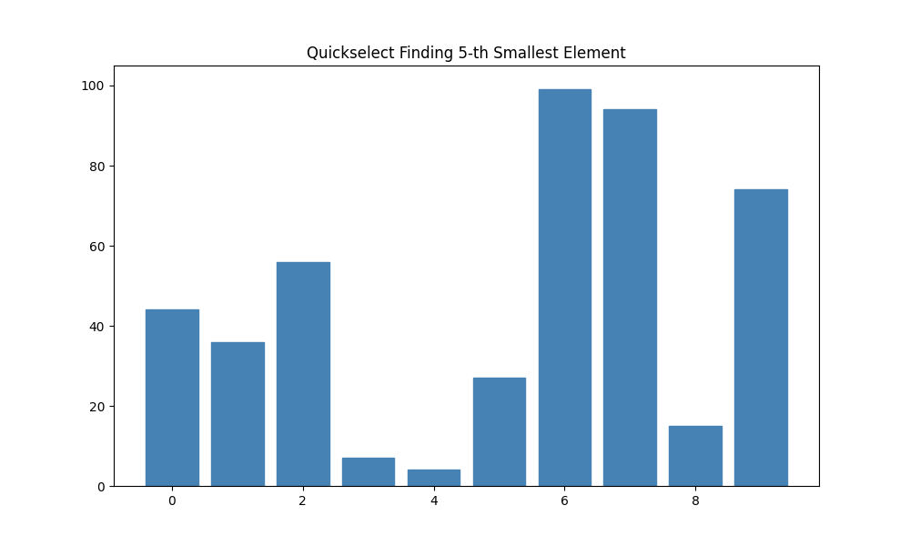
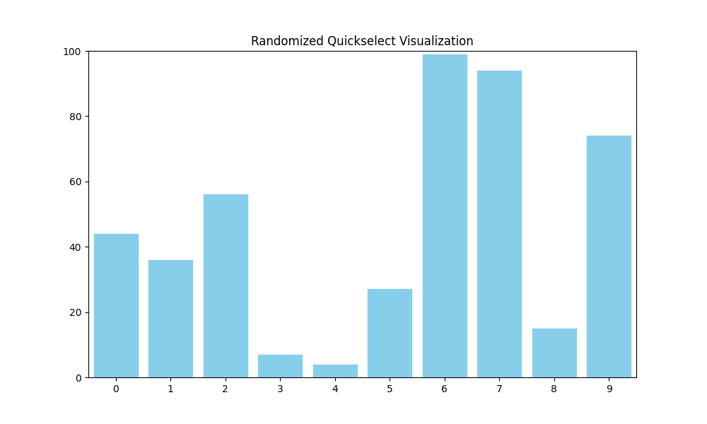

# 📘 Quickselect

## 🧭 1. Overview

Quickselect is an efficient algorithm used to solve the **selection problem**:

> 🎯 **Given an array A with n elements, find the k-th smallest element.**

Examples:

* Smallest element → k = 1
* Largest element → k = n
* Median → k = n/2
* 90th percentile → k = 0.9n

Quickselect is a variant of Quicksort, but instead of fully sorting the array, it recursively narrows down to the region that contains the k-th smallest element.

---

## ⭐ 2. Naive Approaches

### 2.1 Sort and Return

```cpp
Sort(A)
return A[k]
```

⏱ **Time complexity:** Θ(n log n)

### 2.2 Brute Force (Repeated Minimum Extraction)

* Find the smallest element → O(n)
* Remove it → O(1)
* Repeat k times → O(nk)

⛔ **Too slow for large k.**

---

## 🎯 3. Quickselect — Core Idea

Quickselect uses the same **partitioning** idea as Quicksort.

### ⚡ Steps

1. Choose a pivot element `x` (often the last element).
2. Partition the array:

   * Values < x go to the left.
   * Values ≥ x go to the right.
3. After partition:

   * Pivot ends at index `j`.
   * This means **pivot is the j-th smallest element**.
4. Compare `j` with `k`:

   * ✅ If `j == k`: return pivot.
   * ◀️ If `j > k`: recurse left.
   * ▶️ If `j < k`: recurse right with **k' = k − j**.

This is a **divide‑and‑conquer** strategy.

---

## 🔍 4. Visual Partitioning



---

## 🧩 5. Pseudocode

```cpp
QuickSelect(A, k):
    pivot = choosePivot(A)
    j = partition(A, pivot)

    if j == k:
        return A[j]
    else if j > k:
        return QuickSelect(A[1..j-1], k)
    else:
        return QuickSelect(A[j+1..n], k - j)
```

---

## 💻 6. Implementations

### 🔵 C++ Version

```cpp
#include <iostream>
#include <vector>
using namespace std;

int partition(vector<int>& arr, int left, int right) {
    int pivot = arr[right];
    int i = left;
    for (int j = left; j < right; j++) {
        if (arr[j] < pivot) {
            swap(arr[i], arr[j]);
            i++;
        }
    }
    swap(arr[i], arr[right]);
    return i;
}

int quickSelect(vector<int>& arr, int left, int right, int k) {
    if (left <= right) {
        int p = partition(arr, left, right);

        if (p == k) return arr[p];
        else if (p > k) return quickSelect(arr, left, p - 1, k);
        else return quickSelect(arr, p + 1, right, k);
    }
    return -1;
}

int main() {
    vector<int> arr = {3,7,4,6,5,8,9,1,2};
    int k = 3; // 4th smallest
    cout << quickSelect(arr, 0, arr.size() - 1, k);
}
```

---

### 🟢 Python Version

```python
def partition(arr, left, right):
    pivot = arr[right]
    i = left
    for j in range(left, right):
        if arr[j] < pivot:
            arr[i], arr[j] = arr[j], arr[i]
            i += 1
    arr[i], arr[right] = arr[right], arr[i]
    return i


def quick_select(arr, left, right, k):
    if left <= right:
        p = partition(arr, left, right)

        if p == k:
            return arr[p]
        elif p > k:
            return quick_select(arr, left, p - 1, k)
        else:
            return quick_select(arr, p + 1, right, k - p)

# Example
A = [3,7,4,6,5,8,9,1,2]
k = 3
print(quick_select(A, 0, len(A)-1, k))  # 4th smallest
```

---

## 🧪 7. Walkthrough Example

Goal: **Find the 4th smallest element.**

Array:

```cpp
A = [3,7,4,6,5,8,9,1,2]
```

Pivot strategy: always use last element.

### 📌 Step 1 — Pivot = 8

Partition result:

```cpp
[3,7,4,6,5,1,2,8,9]
```

Pivot index → **j = 8** > k → recurse left.

### 📌 Step 2 — Pivot = 5

```cpp
[2,1,3,4,5,6,7]
```

Pivot index → **j = 5** > k → recurse left.

### 📌 Step 3 — Pivot = 4

```cpp
[2,1,3,4]
```

Pivot index → **j = 4 = k** → 🎉 answer found: **4**

[IMAGE PLACEHOLDER: step-by-step Quickselect visualization]

---

## ⚠️ 8. Worst Case Complexity

If pivot is always terrible (smallest/largest element):

```cpp
T(n) = T(n−1) + Θ(n)
```

⛔ **Worst case:** Θ(n²)

This happens when the array is already sorted and pivot selection is poor.

---

## 🎲 9. Randomized Quickselect (Expected Case)

If pivot is chosen **randomly**, the average complexity becomes:

✨ **Θ(n)** expected time

Reason: Random pivot avoids systematic unbalanced partitions.



---

## 📝 10. Summary

* Quickselect solves the **k-th smallest element** problem.
* Uses **partition** like Quicksort.
* Runs in **expected linear time** (random pivot).
* Worst-case can degrade to **quadratic**.
* Widely used in statistics, median finding, percentile calculations, etc.

---
