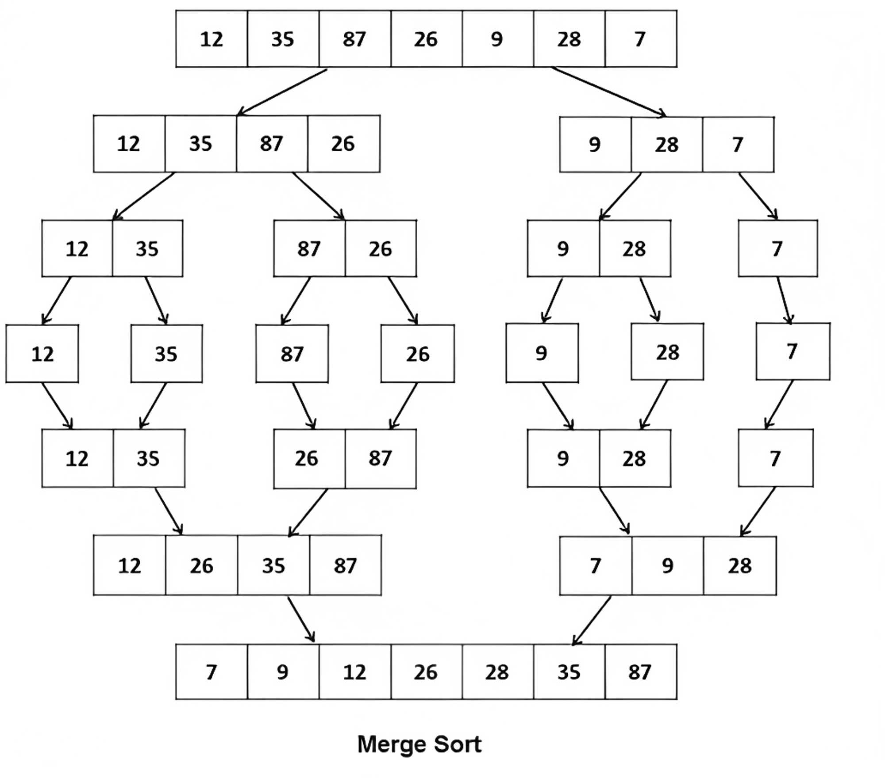
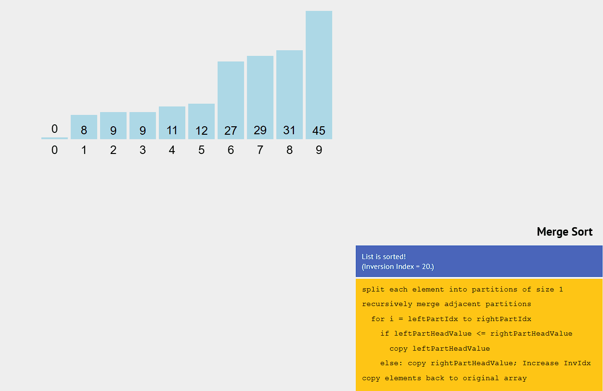

# 🧩 Merge Sort

## 📖 Definition

**Merge Sort** is a **Divide and Conquer** sorting algorithm.
It works by **recursively dividing** an unsorted array into smaller subarrays, sorting them, and then **merging** them back together into a single sorted array.

<div align="center">



</div>

---

## 🔹 Core Idea

> “Divide the problem into smaller parts, solve them independently, and merge the results.”

### Conceptual Flow:

1. **Divide** the array into two halves
2. **Recursively sort** each half
3. **Merge** the two sorted halves into one sorted array

💡 **Why not sort directly?**
Breaking the array into smaller subarrays simplifies sorting — smaller parts are easier to handle and merge efficiently.

---

## 🧮 Step-by-Step Logic

| Step        | Description                                                   |
| ----------- | ------------------------------------------------------------- |
| 1️⃣ Divide  | Split the array into two halves (until each has ≤ 1 element). |
| 2️⃣ Conquer | Sort each half recursively.                                   |
| 3️⃣ Combine | Merge the sorted halves back together.                        |

---

## 🧠 Merge Sort — Pseudocode

```c
function mergeSort(array):
  if length(array) <= 1:
    return array        //✅ Base case: already sorted

  mid: length(array) / 2   // ✂️ Split the array
  leftHalf: mergeSort(array[0..mid-1])   // 🔁 Sort left half
  rightHalf: mergeSort(array[mid..end])  // 🔁 Sort right half

  return: merge(leftHalf, rightHalf)     // 🔗 Merge two halves
```

---

## 🔗 Merge Procedure — Pseudocode

```cpp
function merge(leftArray, rightArray):
    result = empty array      // Temporary array to store merged result
    i = 0                     // Pointer for left array
    j = 0                     // Pointer for right array

    // 🧠 Compare elements from both subarrays and build sorted result
    while i < length(leftArray) AND j < length(rightArray):
        if leftArray[i] <= rightArray[j]:       // If element in left is smaller
            append leftArray[i] to result       // ➕ Add left element to result
            i = i + 1                           // Move left pointer forward
        else:
            append rightArray[j] to result      // ➕ Add right element to result
            j = j + 1                           // Move right pointer forward

    // 🏁 Copy remaining elements (if any) from the left array
    while i < length(leftArray):
        append leftArray[i] to result
        i = i + 1

    // 🏁 Copy remaining elements (if any) from the right array
    while j < length(rightArray):
        append rightArray[j] to result
        j = j + 1

    return result            // ✅ Return fully merged sorted array
```

---

## 🧩 Merge Step Illustration

<div align="center">



</div>

---

## 🐍 Python Example

```python
def merge_sort(arr):
    # Base case: 1 element -> already sorted
    if len(arr) <= 1:
        return arr

    mid = len(arr) // 2
    left = merge_sort(arr[:mid])      # Sort left half
    right = merge_sort(arr[mid:])     # Sort right half

    return merge(left, right)


def merge(left, right):
    result = []
    i = j = 0

    # Compare elements and build the sorted result
    while i < len(left) and j < len(right):
        if left[i] <= right[j]:
            result.append(left[i])    # Add smaller element
            i += 1
        else:
            result.append(right[j])
            j += 1

    # Append leftovers
    result.extend(left[i:])
    result.extend(right[j:])
    return result


arr = [5, 2, 9, 1, 6, 3]
print(merge_sort(arr))
```

---

## 💻 C++ Example

```cpp
#include <iostream>
#include <vector>
using namespace std;

// Merge two sorted halves
void merge(vector<int>& arr, int left, int mid, int right) {
    vector<int> temp;
    int i = left;
    int j = mid + 1;

    // Compare and merge both halves
    while (i <= mid && j <= right) {
        if (arr[i] <= arr[j])
            temp.push_back(arr[i++]);  // Pick smaller from left
        else
            temp.push_back(arr[j++]);  // Pick smaller from right
    }

    // Copy remaining elements
    while (i <= mid) temp.push_back(arr[i++]);
    while (j <= right) temp.push_back(arr[j++]);

    // Copy merged result back to original array
    for (int k = left; k <= right; ++k)
        arr[k] = temp[k - left];
}

// Recursive Merge Sort
void mergeSort(vector<int>& arr, int left, int right) {
    if (left >= right) return;  // Base case: 1 element

    int mid = left + (right - left) / 2;

    mergeSort(arr, left, mid);      // Sort left half
    mergeSort(arr, mid + 1, right); // Sort right half

    merge(arr, left, mid, right);   // Merge both halves
}

int main() {
    vector<int> arr = {5, 2, 9, 1, 6, 3};
    mergeSort(arr, 0, arr.size() - 1);

    for (int num : arr)
        cout << num << " ";
    cout << endl;
    return 0;
}
```

---

## ⏱️ Complexity Analysis

| Operation    | Time Complexity | Space Complexity |
| ------------ | --------------- | ---------------- |
| Best Case    | `O(n log n)`    | `O(n)`           |
| Average Case | `O(n log n)`    | `O(n)`           |
| Worst Case   | `O(n log n)`    | `O(n)`           |

✅ **Stable Sort:** Yes
✅ **Divide & Conquer:** Yes
❌ **In-Place:** No (requires extra memory)

---

## 💡 Key Insights

**Advantages**

* Consistent performance (`O(n log n)`)
* Stable (preserves order of equal elements)
* Works well with linked lists or external data (e.g., file sorting)

**Disadvantages**

* Requires additional space (`O(n)`)
* Recursive overhead may affect small datasets
