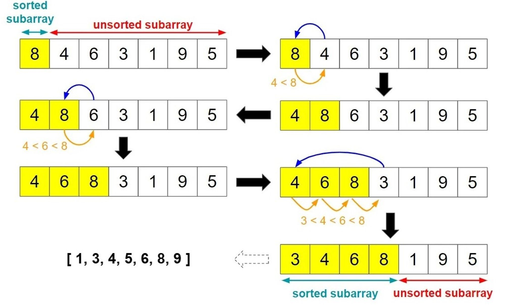

# 🧩 Insertion Sort

## 📖 Definition

**Insertion Sort** is a simple comparison-based sorting algorithm that works by **iteratively inserting each element** into its correct position within the **sorted portion** of the array.

It is intuitive and works similarly to how we might sort playing cards in our hands.

---

## 💡 Core Idea

The array is conceptually divided into two parts:

| Part                   | Description                                |
| ---------------------- | ------------------------------------------ |
| ✅ **Sorted region**    | Left portion of the array (already sorted) |
| ⚙️ **Unsorted region** | Right portion (remaining elements to sort) |

The algorithm repeatedly picks the next element from the **unsorted region** and **inserts it** into the correct position in the **sorted region**.

---

### 🧠 Intuitive Example

Imagine sorting cards in your hand:

1. You start with one card (already sorted).
2. Pick the next card and place it in the correct order among the previous ones.
3. Repeat until all cards are sorted.

---

### 🔍 Visual Example



---

## ⚙️ Algorithm Steps

1. Start from the **second element** (index `1`).
2. Compare the current element (`key`) with elements in the **sorted portion** (left side).
3. **Shift** larger elements one position to the right.
4. Insert `key` into its correct place.
5. Repeat until the array is sorted.

---

## 🧮 Pseudocode

```plaintext
INSERTION-SORT(A)
  for j = 2 to A.length
      key = A[j]
      i = j - 1

      while i > 0 and A[i] > key
          A[i + 1] = A[i]    // shift element to the right
          i = i - 1

      A[i + 1] = key         // place key at correct position
```

### 🎞️ Animated Visualization


---

## 🐍 Python Example

```python
def insertion_sort(arr):
    # Loop through the array starting from the 2nd element
    for i in range(1, len(arr)):
        key = arr[i]  # element to insert
        j = i - 1

        # Move elements of arr[0..i-1] that are greater than key
        while j >= 0 and arr[j] > key:
            arr[j + 1] = arr[j]  # shift element to the right
            j -= 1

        # Insert key at the correct position
        arr[j + 1] = key

# Example usage
nums = [5, 2, 9, 1, 5, 6]
insertion_sort(nums)
print(nums)  # [1, 2, 5, 5, 6, 9]
```

---

## 💻 C++ Example

```cpp
#include <iostream>
using namespace std;

void insertionSort(int arr[], int n) {
    for (int i = 1; i < n; i++) {
        int key = arr[i];   // current element to insert
        int j = i - 1;

        // Shift elements that are greater than key to the right
        while (j >= 0 && arr[j] > key) {
            arr[j + 1] = arr[j];
            j--;
        }

        // Place key at its correct position
        arr[j + 1] = key;
    }
}

int main() {
    int arr[] = {5, 2, 9, 1, 5, 6};
    int n = sizeof(arr) / sizeof(arr[0]);

    insertionSort(arr, n);

    // Print the sorted array
    cout << "Sorted array: ";
    for (int i = 0; i < n; i++)
        cout << arr[i] << " ";
    cout << endl;
}
```

---

## ⏱️ Time & Space Complexity

| Case                      | Time Complexity |
| ------------------------- | --------------- |
| **Best** (Already sorted) | `O(n)`          |
| **Average**               | `O(n²)`         |
| **Worst** (Reverse order) | `O(n²)`         |
| **Space Complexity**      | `O(1)`          |

---

## ✅ Advantages

* Simple and intuitive
* Efficient for **small datasets**
* Works well on **nearly sorted arrays**
* **In-place sorting** (no extra memory)

---

## ⚠️ Disadvantages

* Inefficient for **large datasets**
* High time complexity (`O(n²)`)
* Many element shifts required

---

## 🧠 Summary

| Feature        | Description                              |
| -------------- | ---------------------------------------- |
| Algorithm Type | Comparison-based, in-place               |
| Stability      | ✅ Stable                                 |
| Adaptive       | ✅ Yes (performs well when nearly sorted) |
| Use Case       | Small or partially sorted data           |
